# Registro de Decisões de Arquitetura — harness OAF

**Projeto:** squadAgents
**Escopo:** o harness sob `src/oaf/`, que implementa o [Open Agent Format](https://openagentformat.com/) 0.8.0 (Draft)
**Status:** aceito e implementado
**Última revisão:** 2026-08-27

Este documento registra *por que* o harness tem a forma que tem. Para *o que* ele
cobre da spec e o que deixa de fora deliberadamente, veja
[`docs/CONFORMANCE.md`](docs/CONFORMANCE.md).

---

## 1. Contexto

O OAF define um agente como um **diretório no sistema de arquivos**: um
`AGENTS.md` obrigatório com frontmatter YAML e corpo Markdown, mais diretórios
opcionais de skills, configs de MCP, versões e exemplos. A promessa do formato é
portabilidade — a mesma definição rodando em Claude Code, Goose, Deep Agents,
Letta e outros harnesses.

Duas restrições moldaram tudo o que segue:

1. **A spec delega validação ao harness.** A seção *Validation (Informative)*
   diz explicitamente que checagem de ciclos, conflitos de versão e resolução de
   referências são responsabilidade das ferramentas, não do formato.
2. **A spec e os agentes publicados junto com ela discordam.** Os 9 agentes de
   referência do repositório `OpenHarness` violam a spec em quatro pontos. Um
   harness que só aceitasse a spec literal seria inútil contra o único corpus
   real que existe; um que só aceitasse o corpus real não serviria para autorar
   agentes corretos.

Essa tensão — *ler o mundo real, escrever o formato correto* — é a decisão de
fundo que aparece em quase todos os ADRs abaixo.

---

## 2. Visão geral da arquitetura

O harness é um **pipeline unidirecional**. Cada camada só conhece a anterior, e
nenhuma volta atrás. Isso é o que permite testar validação sem tocar em runtime,
e trocar de harness sem tocar em parsing.

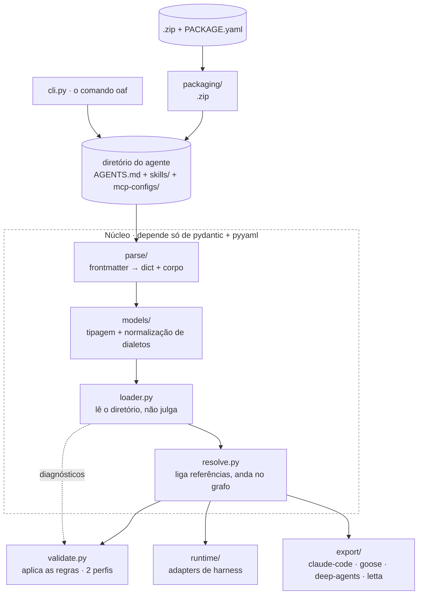

As três estruturas de dados que atravessam o pipeline:

| Estrutura | Produzida por | O que é |
|---|---|---|
| `AgentDocument` | `parse/` | frontmatter tipado + corpo Markdown + linha de início do corpo |
| `LoadedAgent` | `loader.py` | o diretório inteiro em memória: manifesto, skills locais, configs MCP, versões |
| `ResolvedAgent` | `resolve.py` | tudo acima, com cada referência ligada ao que ela aponta e sub-agentes percorridos |
| `BuildResult` | `runtime/` | o agente instanciado + as decisões que o produziram (modelo, prompt, tools) |

---

## ADR-001 — O carregamento lê; a validação julga

**Contexto.** É tentador rejeitar arquivos problemáticos na hora de ler. Mas um
agente com uma skill quebrada ainda é um agente inspecionável, e um autor que
recebe um erro por vez precisa de N execuções para consertar N problemas.

**Decisão.** `load_agent()` lê o diretório e **não emite juízo**. Ele constrói o
`LoadedAgent` e acumula diagnósticos em um `DiagnosticBag`. `validate_agent()` é
quem aplica as regras. A única exceção que o loader levanta é quando o
`AGENTS.md` em si não pode ser lido ou parseado — sem ele não existe agente.

**Consequências.**
- Uma passada reporta *todos* os problemas do agente, não o primeiro.
- `oaf inspect` funciona em agentes inválidos, que é justamente quando se precisa dele.
- O custo: duas etapas onde ingenuamente haveria uma.

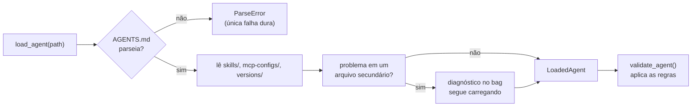

---

## ADR-002 — Diagnóstico é dado, não exceção

**Contexto.** Erros precisam ser: agregáveis, serializáveis para JSON, apontáveis
a arquivo e linha, e classificáveis por severidade que *varia conforme o perfil*.
Exceções não fazem nada disso bem.

**Decisão.** Um `Diagnostic` é uma dataclass congelada com `severity`, `code`,
`message`, `path`, `line`, `field` e `hint`. `DiagnosticBag` os coleta e expõe
`.errors`, `.warnings` e `.ok`. **Warnings nunca reprovam** — só `ERROR` afeta
`.ok` e o código de saída.

**Consequências.**
- `oaf validate --json` cai direto em CI sem tradução.
- O `code` (`identity.slug-not-canonical`) é estável e suprimível; a `message` pode mudar.
- A severidade de uma regra é decidida no ponto de emissão, pelo perfil — não está fixa no tipo.

---

## ADR-003 — Dois perfis de validação, não um

**Contexto.** Esta é a decisão central. Os agentes publicados *junto com a spec*
a violam em quatro pontos:

| Spec diz | Corpus de referência faz |
|---|---|
| `slug` é `vendorKey/agentKey` | um nome solto: `recipe-finder-agent` |
| `entrypoint` fica sob `orchestration:` | `entrypoint:` no nível superior |
| `ActiveMCP.json` usa `selectedTools`/`excludedTools` | usa `enabled_tools`/`disabled_tools` |
| `SKILL.md` exige frontmatter com `name` e `description` | vários não têm frontmatter algum |

Um harness rígido reprova 9 de 9 agentes reais. Um harness permissivo deixa
autores novos escreverem os mesmos desvios para sempre.

**Decisão.** Duas posturas sobre o **mesmo conjunto de regras**:

- **`lenient`** (padrão) — para *consumir* agentes do mundo real. Os desvios
  listados no conjunto `NEGOTIABLE` viram warnings.
- **`strict`** — para *autorar* agentes novos. Toda regra da spec é erro.

`NEGOTIABLE` é um conjunto explícito e pequeno em `validate.py`. Regras fora dele
têm a mesma severidade nos dois perfis.

**Consequências.**
- Os 9 agentes de referência passam em `lenient` e, em `strict`, acusam exatamente os desvios documentados — isso é um teste (`test_reference_corpus.py`).
- Um desvio novo entra pelo `NEGOTIABLE` com uma linha e um comentário dizendo qual agente real o exibe.
- O risco: `NEGOTIABLE` crescer sem disciplina até virar "aceita tudo". Mitigação: cada entrada aponta um agente real observado.

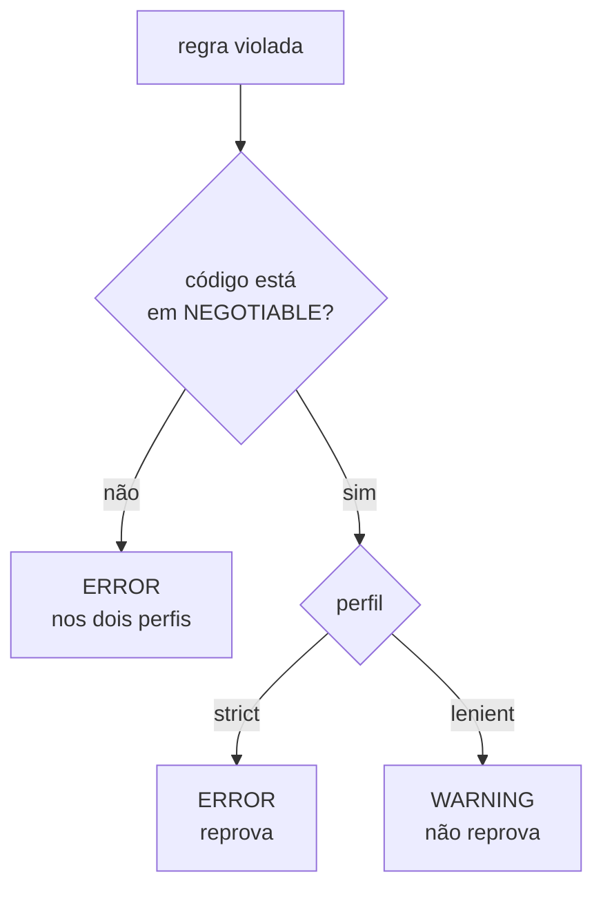

---

## ADR-004 — Leitura permissiva, escrita canônica

**Contexto.** Três arquivos do formato existem em mais de um dialeto no mundo
real: `ActiveMCP.json` (2), `config.yaml` (2) e `PACKAGE.yaml` (**3** — o da spec,
o do pacote multi-agente publicado, e o gerado dentro dos zips de amostra).
Ramificar em cada ponto de uso multiplicaria a complexidade por todo o código.

**Decisão.** A normalização acontece **uma vez, na fronteira do modelo**, em um
`@model_validator(mode="before")` do pydantic. Cada modelo aceita qualquer
dialeto e expõe uma visão única. O dialeto de origem fica registrado no campo
`dialect`, para diagnóstico e para `oaf inspect`.

Na direção oposta, **`oaf package` sempre escreve o dialeto da spec**.

**Consequências.**
- Nenhum código acima de `models/` sabe que existem dialetos.
- Um zip publicado no dialeto *toolkit* desempacota, re-empacota no dialeto *spec* e desempacota de novo — verificado ponta a ponta.
- Curiosidade que essa camada resolve: os exemplos escrevem `admin.*` em `disabled_tools`. Como nome literal de tool isso não significa nada, então `ActiveMcp.permits()` trata `*` final como prefixo.

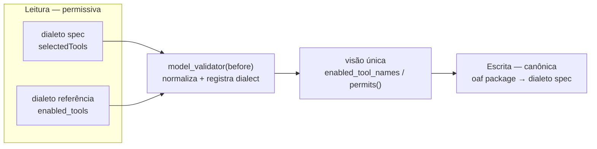

---

## ADR-005 — Adapters de harness plugáveis, com import tardio

**Contexto.** A spec existe para que um agente rode em vários harnesses. Amarrar
o harness a um framework de agentes contradiria o propósito. Além disso,
validar e empacotar um agente não deveria exigir um SDK de LLM instalado.

**Decisão.** `HarnessAdapter` é uma ABC com dois métodos: `build()` e `run()`. O
método concreto `plan()` centraliza as três decisões que todo adapter toma
(modelo, prompt, modo de skills). Registro em `ADAPTERS`, obtido por
`get_adapter(name)`.

O núcleo depende só de `pydantic` e `pyyaml`. **`agno` é importado dentro da
função**, não no topo do módulo, e o `ImportError` vira uma `HarnessError` com a
instrução de instalação.

Dois adapters hoje:
- **`dry-run`** — resolve, compõe prompt e escolhe modelo, sem instanciar cliente algum. É o que `oaf inspect` e os testes usam.
- **`agno`** — constrói `Agent` e `Team` de verdade.

**Consequências.**
- A suíte inteira de parsing, validação, resolução, packaging e export roda sem chave de API e sem rede.
- Adicionar um harness é uma classe e uma entrada no dicionário.
- `dry-run` levanta `HarnessError` se alguém tentar executá-lo — ele constrói, não roda.

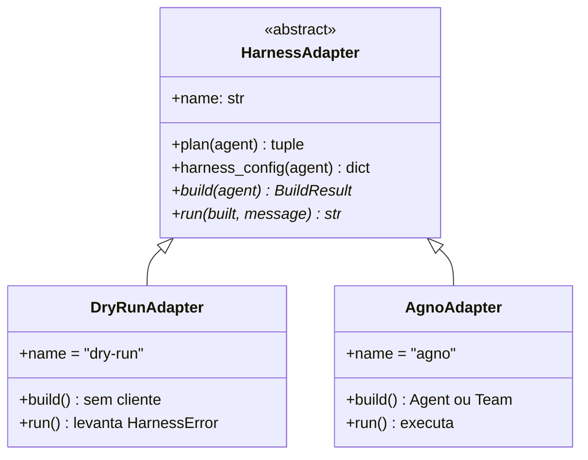

---

## ADR-006 — Sub-agentes viram um Team, cada um com seu próprio modelo

**Contexto.** O campo `agents:` do OAF descreve delegação: papel (`role`) e
tarefas (`delegations`). Agno tem `Team`, cuja semântica é exatamente essa.

**Decisão.** Um agente com sub-agentes resolvidos constrói um `Team` liderado por
ele; sem sub-agentes, um `Agent` simples. **Cada membro é construído
recursivamente pelo mesmo `build()`**, então cada um recebe o modelo que o seu
próprio manifesto pede.

**Consequências.**
- Um `data-analyst` em `gpt-5.2` lidera um `code-reviewer` em `claude-sonnet-5`, na mesma execução — que é o que os manifestos dizem.
- **Um bug que isso já produziu:** a primeira versão criava o `Team` sem passar `tools`, e o líder perdia acesso às próprias skills. Hoje há um teste travando isso (`test_agno_team_leader_keeps_its_tools`).

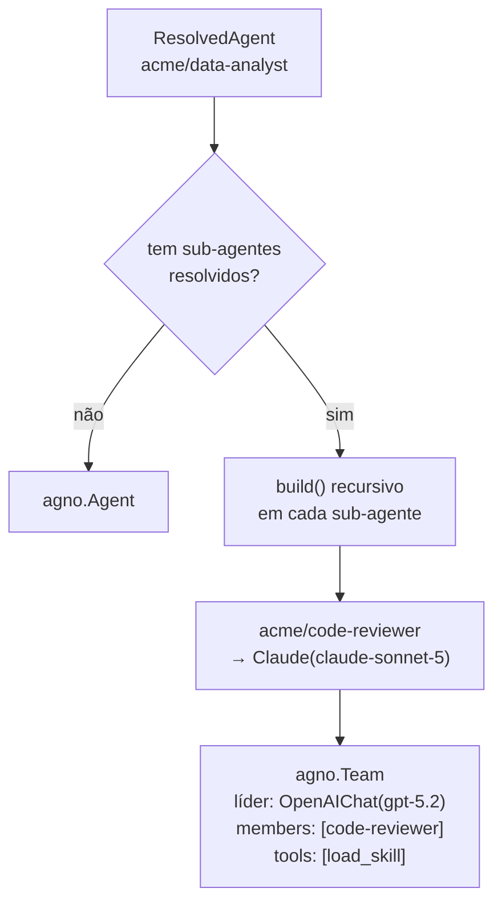

---

## ADR-007 — Skills carregam progressivamente, via tool

**Contexto.** Inlinar o corpo de toda skill no system prompt queima contexto com
instruções que talvez nunca sejam usadas. A spec prevê isso: o
`harnessConfig.claude-code.progressive-disclosure` existe exatamente para essa
escolha.

**Decisão.** Dois modos, com `progressive` como padrão:

- **`progressive`** — o prompt lista só nome e descrição de cada skill, mais os arquivos em `resources/`, `scripts/` e `assets/`. Uma tool `load_skill(name)` devolve o corpo completo sob demanda.
- **`eager`** — todo corpo entra no prompt.

O modo vem de `harnessConfig.<harness>.progressive-disclosure` quando presente,
e pode ser forçado por `--skills`.

**Consequências.**
- O prompt inicial fica proporcional ao *número* de skills, não ao tamanho delas.
- `load_skill` com nome inexistente devolve a lista de skills disponíveis, em vez de erro — o modelo se recupera sozinho.
- Skills `source: local` não resolvidas não geram tool alguma.

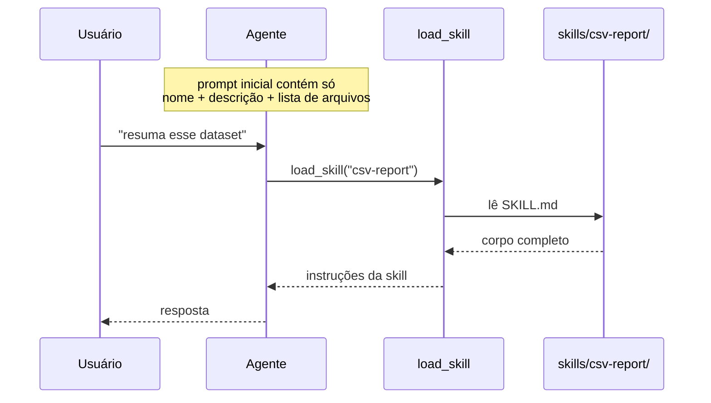

---

## ADR-008 — A tabela de aliases de modelo é dado, não lógica

**Contexto.** A spec define `"sonnet"`, `"opus"` e `"haiku"` como "o mais recente
daquele nível". "Mais recente" muda; a spec não. Uma tabela hardcoded fica
desatualizada e obriga a editar código.

**Decisão.** `DEFAULT_ALIASES` é um dicionário em `runtime/models.py`, sobrescrevível
em três níveis, do mais fraco ao mais forte:

1. o padrão da tabela;
2. `OAF_MODEL_SONNET=openai/gpt-5.2` no ambiente, por alias;
3. `--model` na linha de comando, que vence tudo.

Um alias desconhecido não é erro: é tratado como id literal de modelo (o autor
pode ter digitado um id direto), com um warning. O `ResolvedModel` carrega
`origin`, dizendo qual dos caminhos decidiu.

**Consequências.**
- Qualquer agente roda em qualquer modelo sem editar o `AGENTS.md` dele.
- `oaf inspect` mostra o modelo resolvido *e a origem* — sem adivinhação.

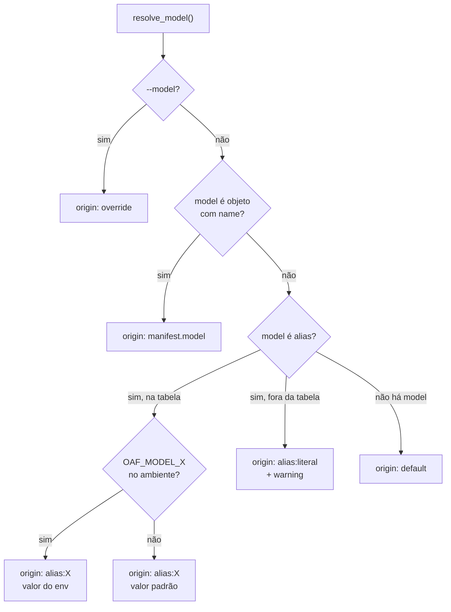

---

## ADR-009 — Ciclos e ambiguidades são reportados, nunca adivinhados

**Contexto.** Delegação entre agentes é um grafo, e grafos escritos à mão têm
ciclos. Além disso, o `Workspace` registra agentes também pelo `agentKey` puro
(conveniência para pacotes cujos agentes omitem o prefixo do vendor) — e dois
vendors podem reivindicar o mesmo `agentKey`.

**Decisão.** Duas regras:

1. **Ciclo é diagnóstico, não exceção.** `_resolve_sub_agent` carrega a cadeia de
   slugs; ao reencontrar um, emite `agent.cycle` nomeando o caminho inteiro
   (`acme/alpha -> acme/beta -> acme/alpha`) e para a recursão ali. Há também um
   teto de profundidade (`max_depth=8`) com o seu próprio código.
2. **Ambiguidade não é resolvida por sorteio.** Se dois vendors reivindicam o
   mesmo `agentKey` puro, `Workspace.get()` devolve `None` para essa chave e a
   resolução emite `agent.ambiguous`. Os slugs canônicos de cada um continuam
   resolvendo normalmente.

**Consequências.**
- Um pacote com ciclo é inspecionável: você vê o ciclo, e o resto do agente.
- **Isto foi um bug real corrigido em revisão:** o fallback por `agentKey` puro ligava silenciosamente `acme/x` a `other/x`. Um sub-agente errado é pior do que um sub-agente ausente, porque não falha — só age errado.

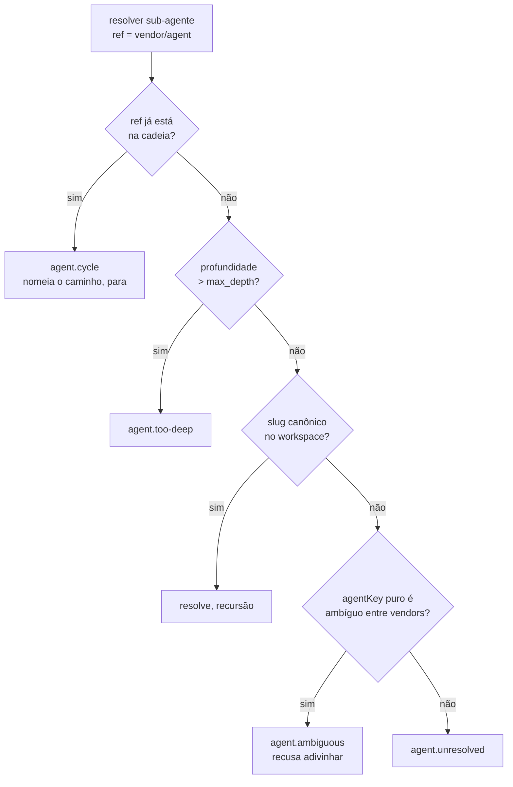

---

## ADR-010 — Duas capacidades ficaram de fora, e isso é uma decisão

**Contexto.** A spec descreve duas coisas que um harness "faz" e que não foram
implementadas. Isso precisa estar registrado como escolha, não como pendência
esquecida.

**Decisão e razões.**

**Skills well-known não são baixadas.** A spec manda buscar
`https://…/.well-known/skills/{name}/SKILL.md` no momento do install. Isso é
buscar instruções remotas que **entram direto num system prompt** — ou seja,
conteúdo de terceiro virando comportamento do agente. Isso pertence a um passo
de instalação explícito e auditável, não ao interior de `load_agent()`. Skills
assim são marcadas `deferred`, aparecem em `oaf inspect` e são nomeadas no
prompt como não empacotadas.

**Servidores MCP são descritos, não conectados.** Conectar significa abrir uma
sessão viva por servidor, com um ciclo de vida que alguém precisa possuir. Um
`build()` síncrono é o lugar errado. O que *é* feito: o subset de tools do
`ActiveMCP.json` é computado e aplicado — `ActiveMcp.permits()` é o ponto de
aplicação — e o prompt descreve os servidores e suas tools. O `BuildResult.notes`
diz explicitamente que a conexão não foi feita.

**Weblets não são implementados.** A spec define os campos e os três modos de
launch, mas não o que um weblet *é* em runtime.

**Consequências.** Cada lacuna aparece em `BuildResult.notes` e em
`docs/CONFORMANCE.md`. Nenhuma falha em silêncio.

---

## ADR-011 — Export é lossy, e diz o que perdeu

**Contexto.** A tabela *Export Compatibility* da spec nomeia quatro alvos, cada
um com um formato mais pobre que o OAF. Claude Code não tem `config.tools.denied`;
nenhum alvo carrega packs ou weblets.

**Decisão.** Todo exporter devolve um `ExportResult` com `files` e **`notes`**. As
notas dizem, item a item, o que não atravessou. Identidade que o formato-alvo
não comporta é preservada no corpo, sob uma seção de proveniência, em vez de
sumir.

**Consequências.** Um export nunca finge ser fiel. O usuário vê a lista do que
precisa reconfigurar no harness de destino.

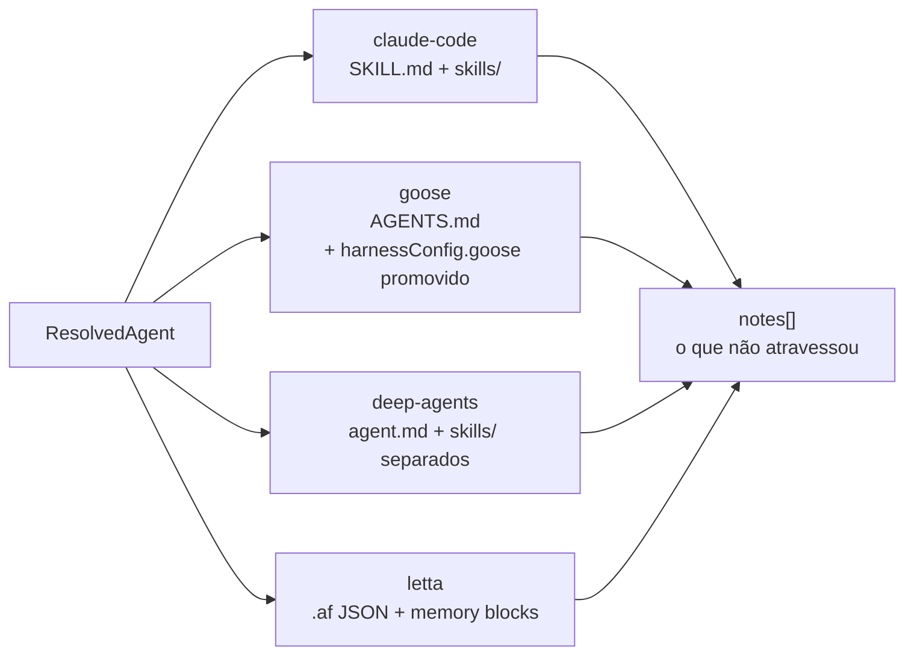

---

## ADR-012 — Fixtures são a spec; o corpus real é a realidade

**Contexto.** Testar um parser de formato contra exemplos que você mesmo escreveu
prova pouco.

**Decisão.** Duas camadas de teste:

1. **Fixtures próprias** (`tests/fixtures/`) — uma por regra. `valid/minimal` é o
   Quick Start da spec; `valid/full-featured` exercita *todo* bloco opcional;
   `invalid/*` tem um diretório por motivo de rejeição; `cycles/` trava a
   detecção de ciclo.
2. **Corpus de referência** (`test_reference_corpus.py`) — os 9 agentes
   publicados junto com a spec. Ele fixa dois fatos: todos passam em `lenient`, e
   sob `strict` os erros são **exatamente** os desvios documentados, nada além.
   É pulado quando o corpus não está clonado; `OAF_REFERENCE_CORPUS` aponta para
   outro clone.

**Consequências.**
- Se a spec evoluir e o corpus for corrigido, o teste de corpus quebra — e deve mesmo.
- 77 testes hoje, rodando em ~3s, sem rede e sem chave de API.

---

## 3. Fluxos completos

### 3.1 `oaf run` — do diretório à resposta

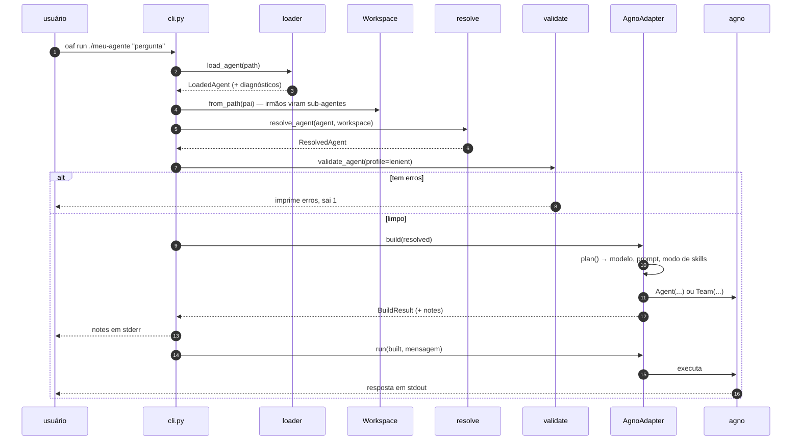

Detalhe deliberado: `oaf run` valida em `lenient` e **recusa executar** se houver
erro. Rodar um agente cuja definição está quebrada produz comportamento
inexplicável.

### 3.2 Composição do system prompt

O corpo Markdown é a instrução; o resto é contexto que o corpo pressupõe mas não
repete. `build_system_prompt()` monta nesta ordem:

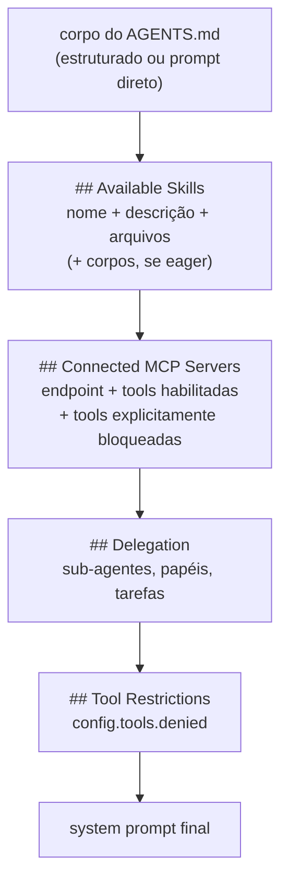

A detecção do formato de instrução segue a regra da spec: corpo começando com
`#` é *estruturado*; qualquer outra coisa é *prompt direto*. Linhas em branco
iniciais são ignoradas — a regra é sobre o primeiro conteúdo, não o primeiro byte.

### 3.3 Ciclo de vida de um pacote

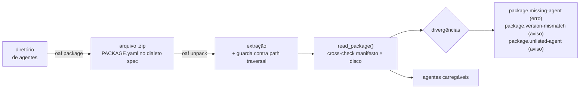

`extract_package` recusa membros com caminho absoluto ou `..` antes de extrair
qualquer coisa — um zip é conteúdo de terceiro.

---

## 4. Decisões menores, registradas

| Decisão | Razão |
|---|---|
| `argparse`, não Typer/Click | mantém o núcleo em duas dependências |
| `extra="allow"` nos modelos | chaves desconhecidas são preservadas e reportadas como aviso, não descartadas em silêncio |
| Regex oficial do semver.org | `version: 1.0` é rejeitado; YAML o entregaria como float |
| Números coeridos para texto antes de validar | `version: 1.0` chega como `float` e viraria `"1.0"` silenciosamente |
| SPDX como conjunto de reconhecimento, não portão | a lista completa tem ~600 entradas; desconhecido vira aviso |
| `Workspace` indexa por slug canônico, slug do arquivo e `agentKey` | agentes reais discordam sobre qual usar (ver ADR-009 para o limite disso) |

---

## 5. O que este documento não decide

`src/agents/agent_terraform.py`, `agent_validador.py` e `agent_orchestrador.py`
continuam vazios. Eles são **consumidores** deste harness, não parte dele: a
arquitetura acima não pressupõe nada sobre o fluxo entre eles. Quando esse
desenho fechar, ele merece o seu próprio ADR.
