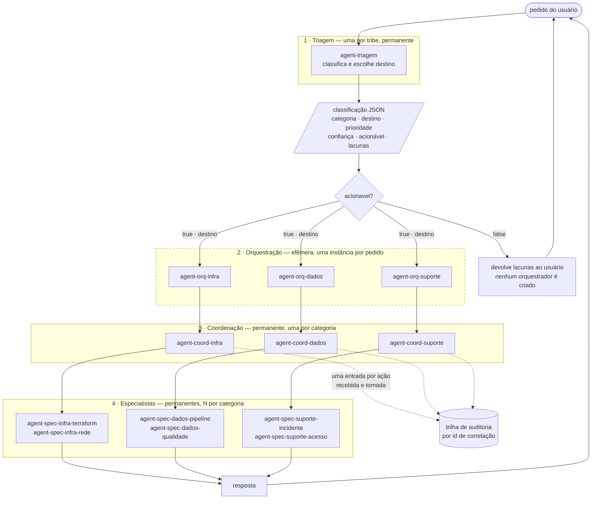
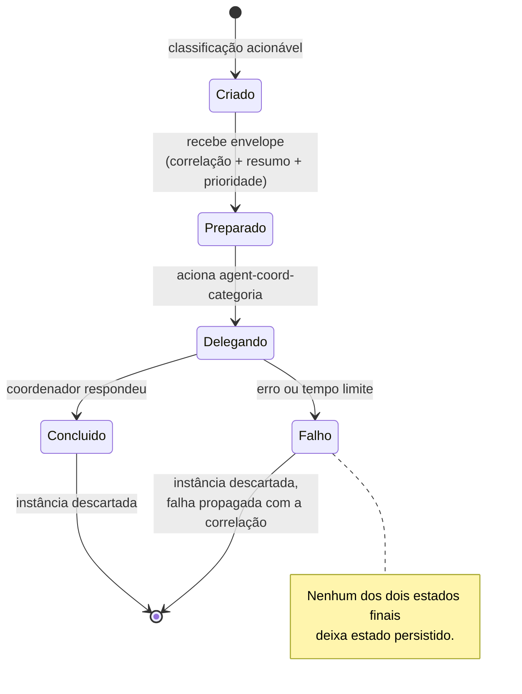
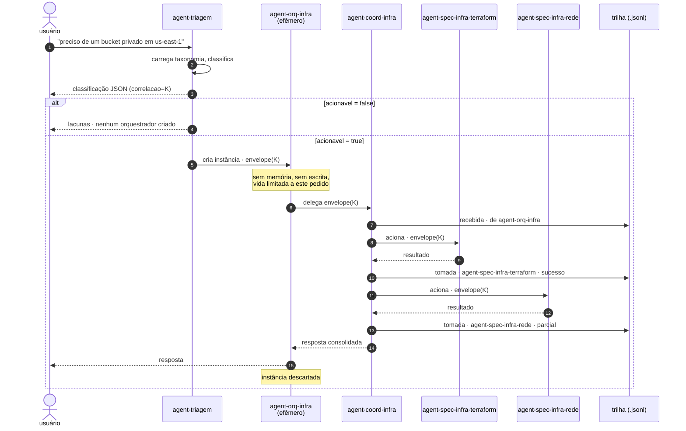

# SDD · Tribe com orquestradores efêmeros

**Documento de Desenho de Software**
**Versão:** 0.1 (rascunho para revisão)
**Status:** proposto — não implementado
**Escopo:** a arquitetura de quatro camadas da tribe, sobre o harness OAF deste repositório

---

## 1. Objetivo

Especificar uma tribe em que um pedido do usuário atravessa quatro camadas com
responsabilidades separadas:

1. **Triagem** classifica o pedido e escolhe o destino.
2. Um **orquestrador efêmero**, criado por pedido, conduz aquele pedido e morre.
3. Um **coordenador de squad**, permanente, atende a categoria e **registra em
   log tudo o que recebe e tudo o que aciona**.
4. **Agentes especializados** executam o trabalho concreto.

O que este documento decide: as taxonomias de nome, os contratos de dados entre
camadas, o ciclo de vida do orquestrador efêmero, o modelo de log, e os casos de
uso que a tribe deve atender.

O que **não** decide: a implementação. Ver [§10](#10-delta-em-relação-ao-que-existe-hoje)
para o que muda no que já está no repositório.

---

## 2. Visão geral da tribe



O tracejado da camada 2 marca o que é efêmero. As camadas 1, 3 e 4 são
permanentes: existem como diretórios no disco e atendem muitos pedidos.

---

## 3. Taxonomia de nomes

### 3.1 O conflito com a spec, e a proposta

A taxonomia pedida usa **underscore**: `agent_orq_<categoria>`,
`agent_coord_<categoria>`. A spec do OAF exige `vendorKey` e `agentKey` em
**kebab-case**, e define `slug` como `vendorKey/agentKey`. Verificado contra o
validador deste repositório:

| Identificador | `is_kebab_case` | Consequência |
|---|---|---|
| `agent_orq_infra` | ✗ | `oaf validate --profile strict` **reprova** com `identity.not-kebab-case` |
| `agent-orq-infra` | ✓ | passa |

Três saídas possíveis:

| Opção | Consequência |
|---|---|
| **A — hífen em tudo** (recomendada) | `agent-orq-infra` é o nome único, em disco, no JSON e no log. Uma representação só, sem tradução. |
| B — underscore no domínio, hífen no disco | `agent_orq_infra` no JSON e no log, `agent-orq-infra` no `agentKey`, com bijeção `_ ↔ -`. Preserva o vocabulário pedido, ao custo de duas representações do mesmo nome. |
| C — underscore em tudo | Exige rodar sempre em perfil `lenient` e rebaixar `identity.not-kebab-case`, abrindo mão da checagem de identidade para *todos* os agentes. |

**Recomendação: A.** Duas representações do mesmo identificador é a origem
clássica de bug de roteamento — basta uma tradução esquecida em um ponto para o
pedido cair no vazio. O ganho da B é vocabulário; o custo é uma classe de
defeito. A C troca uma regra de qualidade global por uma preferência de grafia.

O restante deste documento usa a opção A. Se a decisão for a B, o único ponto
que muda é a fronteira de serialização — os contratos da [§5](#5-contratos-de-dados)
passam a carregar a forma com underscore, e o carregador aplica a bijeção.

### 3.2 As quatro formas

| Camada | Padrão | Exemplos | Cardinalidade |
|---|---|---|---|
| Triagem | `agent-triagem` | `agent-triagem` | 1 por tribe |
| Orquestração | `agent-orq-<categoria>` | `agent-orq-infra` | 1 **instância por pedido** |
| Coordenação | `agent-coord-<categoria>` | `agent-coord-dados` | 1 por categoria |
| Especialista | `agent-spec-<categoria>-<especialidade>` | `agent-spec-infra-terraform` | N por categoria |

`<categoria>` vem do enum fechado da triagem. Acrescentar uma categoria implica
acrescentar, no mínimo, um orquestrador e um coordenador — ver
[UC-10](#uc-10--nova-categoria-entra-na-tribe).

### 3.3 Regra de derivação

O campo `destino` da classificação **é** o `agentKey` do orquestrador:

```
destino = "agent-orq-" + categoria
```

Essa derivação é a única ligação entre triagem e orquestração. Não há tabela de
roteamento em lugar nenhum: acrescentar uma categoria e criar o diretório
`agent-orq-<categoria>/` basta.

> **Invariante R1.** Para toda `categoria` acionável do enum, existe um agente
> com `agentKey == "agent-orq-" + categoria`. Verificável estaticamente, sem
> executar modelo.

---

## 4. Componentes

### 4.1 Triagem — `agent-triagem`

**Responsabilidade.** Classificar o pedido e escolher o destino. Nada mais.

**Entrada.** Texto livre do usuário.
**Saída.** A classificação JSON da [§5.1](#51-classificação-de-triagem).

Quando `acionavel` é `false`, **nenhum orquestrador é criado**: a triagem
devolve as lacunas e o fluxo termina. Isso é o que torna a camada efêmera
barata — pedidos incompletos não custam instância.

### 4.2 Orquestrador efêmero — `agent-orq-<categoria>`

**Responsabilidade.** Conduzir *um* pedido, da classificação até a resposta.

Efêmero tem significado preciso aqui, e cada item é verificável:

| Propriedade | Significado | Como se verifica |
|---|---|---|
| Sem estado | não declara bloco `memory:` | estático, no manifesto |
| Sem escrita | não tem tool que altere o mundo; `config.tools.denied` cobre shell e rede | estático |
| Instância por pedido | recebe um `correlacao` e não o reusa | em runtime, no log |
| Vida limitada | termina após a delegação retornar; teto de profundidade e de tempo | em runtime |
| Sem memória entre pedidos | dois pedidos idênticos produzem dois traços independentes | em runtime, no log |

A **definição** é permanente — é um diretório em disco. A **instância** é que é
efêmera. Essa distinção importa: versionar o comportamento do orquestrador é
versionar o diretório, como qualquer outro agente OAF.

**Por que existir**, se a triagem já escolheu o destino: a orquestração é onde
mora a política *daquela categoria* — se um pedido de infra precisa passar por
aprovação de custo antes do coordenador, se um incidente crítico aciona
escalonamento em paralelo. Colocar isso na triagem a faria crescer sem limite;
colocar no coordenador misturaria política de entrada com execução.



### 4.3 Coordenador de squad — `agent-coord-<categoria>`

**Responsabilidade.** Atender a categoria acionando especialistas, e **registrar
o que recebe e o que aciona**.

É a única camada que escreve log de negócio, e a razão é topológica: é o único
ponto por onde passa tanto a entrada quanto todas as saídas de uma categoria.

**Obrigações:**

1. Emitir uma entrada de log `direcao: "recebida"` ao receber a delegação.
2. Emitir uma entrada `direcao: "tomada"` por especialista acionado, com o
   resultado.
3. Propagar o `correlacao` **inalterado** para cada especialista.
4. Nunca executar o trabalho por conta própria. Se nenhum especialista cobre o
   pedido, registrar `resultado: "recusado"` e devolver o motivo.

### 4.4 Especialista — `agent-spec-<categoria>-<especialidade>`

**Responsabilidade.** O trabalho concreto. É a folha da árvore: não delega.

> **Invariante R2.** Especialista não tem `agents:` no manifesto. Um especialista
> que delegasse reabriria o grafo e tornaria a trilha de log incompleta.

---

## 5. Contratos de dados

### 5.1 Classificação de triagem

Já existe em `tribe/manager/skills/taxonomia/resources/triagem.schema.json`. As
mudanças que este desenho exige:

| Campo | Hoje | Passa a ser |
|---|---|---|
| `destino` | enum `tribe/infra` \| `tribe/dados` \| `tribe/suporte` \| `nenhum` | `agent-orq-<categoria>` derivado, ou `nenhum` |
| `correlacao` | — | **novo**: identificador do pedido, gerado na triagem, propagado até a folha |

### 5.2 Envelope de delegação

O que atravessa cada fronteira entre camadas. Igual em todas, o que permite que
a trilha seja reconstruída sem conhecer a camada:

```json
{
  "correlacao": "01JQ8F3K2M4N5P6Q7R8S9T0V1W",
  "origem": "agent-orq-infra",
  "destino": "agent-coord-infra",
  "categoria": "infraestrutura",
  "prioridade": "alta",
  "resumo": "Provisionar bucket S3 privado em us-east-1, ambiente dev",
  "contexto": {}
}
```

`resumo` é o texto **normalizado** pela triagem, nunca o pedido original — a
mesma regra que o squad em `squad/` já segue.

### 5.3 Entrada de log do coordenador

Uma linha JSON por ação. Formato de linhas JSON (`.jsonl`), append-only.

```json
{
  "ts": "2026-08-27T14:03:12.481Z",
  "correlacao": "01JQ8F3K2M4N5P6Q7R8S9T0V1W",
  "coordenador": "agent-coord-infra",
  "direcao": "recebida",
  "contraparte": "agent-orq-infra",
  "acao": "atender-provisionamento",
  "resultado": "aceito",
  "detalhe": "Pedido aceito; dois especialistas serão acionados",
  "duracao_ms": 0
}
```

| Campo | Tipo | Valores |
|---|---|---|
| `ts` | string | ISO 8601 em UTC, com milissegundos |
| `correlacao` | string | idêntico em toda a trilha de um pedido |
| `coordenador` | string | `agent-coord-<categoria>` |
| `direcao` | string | `recebida` \| `tomada` |
| `contraparte` | string | quem delegou, ou quem foi acionado |
| `acao` | string | verbo em kebab-case |
| `resultado` | string | `aceito` \| `sucesso` \| `parcial` \| `falha` \| `recusado` |
| `detalhe` | string | uma frase; sem segredo, sem dado pessoal |
| `duracao_ms` | número | `0` para `recebida` |

> **Invariante R3.** Toda entrada `recebida` de uma correlação tem zero ou mais
> entradas `tomada` com a mesma correlação, e o conjunto fecha: nenhuma `tomada`
> existe sem a `recebida` correspondente.

### 5.4 Quem escreve o log — a decisão que mais importa aqui

Há duas fontes possíveis, e elas **não** têm o mesmo valor:

| Fonte | O que é | Confiabilidade |
|---|---|---|
| **Log declarado pelo agente** | o coordenador emite as entradas como parte da sua resposta, como a triagem emite o JSON | é uma *afirmação* do modelo. Pode omitir uma ação que tomou, ou declarar uma que não tomou |
| **Traço do harness** | o harness registra `build`, `delegate` e `complete` ao executá-los | é um *registro*. Só existe se a coisa aconteceu |

**Proposta.** Implementar as duas, com papéis distintos: o traço do harness é a
fonte de verdade para auditoria; o log declarado carrega a semântica de negócio
(o `acao`, o `detalhe`) que o harness não conhece. A conciliação entre os dois —
toda delegação do traço tem uma entrada `tomada` correspondente — vira uma
verificação, e a divergência é sinal de que o coordenador não está registrando o
que faz.

Nenhum dos dois existe hoje no harness. O traço é a mudança de núcleo que este
desenho exige; ver [§10](#10-delta-em-relação-ao-que-existe-hoje).

---

## 6. Fluxo completo



---

## 7. Casos de uso

| ID | Caso | Ator | Camadas envolvidas |
|---|---|---|---|
| [UC-01](#uc-01--pedido-acionável-roteado-e-atendido) | Pedido acionável roteado e atendido | usuário | 1 → 4 |
| [UC-02](#uc-02--pedido-incompleto-devolvido) | Pedido incompleto devolvido | usuário | 1 |
| UC-03 | Pedido fora de escopo recusado | usuário | 1 |
| [UC-04](#uc-04--categoria-sem-orquestrador-provisionado) | Categoria sem orquestrador provisionado | operador | 1 → 2 |
| UC-05 | Coordenador aciona um único especialista | — | 3 → 4 |
| UC-06 | Coordenador aciona vários especialistas | — | 3 → 4 |
| UC-07 | Nenhum especialista cobre o pedido | — | 3 |
| UC-08 | Especialista falha e o coordenador registra | — | 3 → 4 |
| [UC-09](#uc-09--auditoria-de-um-pedido-por-correlação) | Auditoria de um pedido por correlação | auditor | log |
| [UC-10](#uc-10--nova-categoria-entra-na-tribe) | Nova categoria entra na tribe | operador | 1 → 3 |
| UC-11 | Coordenador discorda da triagem e devolve | — | 3 → 1 |
| UC-12 | Incidente crítico com escalonamento paralelo | usuário | 2 → 4 |
| UC-13 | Orquestrador excede o tempo limite | — | 2 |
| UC-14 | Divergência entre traço e log declarado | auditor | log |

### UC-01 · Pedido acionável roteado e atendido

**Ator:** usuário. **Pré-condição:** existe `agent-orq-<categoria>` para a
categoria classificada (R1).

1. O usuário descreve o pedido em linguagem natural.
2. A triagem carrega a taxonomia, classifica, gera `correlacao` e emite o JSON
   com `acionavel: true` e `destino` derivado da categoria.
3. Uma instância de `agent-orq-<categoria>` é criada com o envelope.
4. O orquestrador aplica a política da categoria e delega ao coordenador.
5. O coordenador registra `recebida`, aciona os especialistas necessários e
   registra uma `tomada` por especialista.
6. O coordenador consolida e devolve; o orquestrador devolve ao usuário e é
   descartado.

**Pós-condição:** a trilha da correlação está fechada (R3) e nenhum estado do
orquestrador persistiu.

### UC-02 · Pedido incompleto devolvido

**Ator:** usuário.

1. A triagem classifica com `acionavel: false` e ao menos uma lacuna.
2. **Nenhum orquestrador é criado** e nenhuma entrada de log é escrita — não
   houve ação de coordenador.
3. As lacunas voltam ao usuário como perguntas.

**Fluxo alternativo:** o usuário responde e o pedido reentra pelo UC-01, com uma
**nova** correlação. Um pedido incompleto e sua reformulação são dois pedidos.

### UC-04 · Categoria sem orquestrador provisionado

**Ator:** operador da tribe. **Gatilho:** a invariante R1 foi violada — o enum de
categorias ganhou um valor sem o diretório correspondente.

1. A triagem classifica em uma categoria acionável.
2. A derivação produz um `destino` que não resolve para agente algum.
3. O sistema **falha explicitamente**, nomeando o `agentKey` esperado.

Não há degradação para uma categoria vizinha: rotear para o squad errado é pior
que não rotear, porque consome o tempo do time errado e esconde a lacuna de
provisionamento.

**Prevenção:** R1 é verificável estaticamente, então isto deve reprovar em CI
antes de chegar a runtime.

### UC-09 · Auditoria de um pedido por correlação

**Ator:** auditor. **Pré-condição:** a trilha contém a correlação.

1. O auditor filtra a trilha por `correlacao`.
2. Obtém a entrada `recebida`, com quem delegou e quando.
3. Obtém as entradas `tomada`, em ordem, com contraparte, resultado e duração.
4. Reconstrói o que foi feito, por quem e com que desfecho — sem ler prosa.

**Pós-condição:** a reconstrução é completa se R2 e R3 valerem. R2 garante que
não há delegação abaixo do especialista escapando ao registro.

### UC-10 · Nova categoria entra na tribe

**Ator:** operador. Exemplo: acrescentar `seguranca`.

1. Acrescenta `seguranca` ao enum `categoria` do schema de triagem.
2. Acrescenta a linha correspondente na tabela de fronteiras da skill
   `taxonomia` — sem ela a triagem não sabe distinguir a categoria nova das
   vizinhas.
3. Cria `agent-orq-seguranca/` e `agent-coord-seguranca/`.
4. Cria ao menos um `agent-spec-seguranca-*`.
5. CI verifica R1 e reprova se algum passo ficou para trás.

**Pós-condição:** nenhuma tabela de roteamento foi editada — a derivação da
[§3.3](#33-regra-de-derivação) cobre a categoria nova automaticamente.

---

## 8. Requisitos não funcionais

| # | Requisito | Verificação |
|---|---|---|
| NF-1 | Toda camada permanente passa em `oaf validate --profile strict` | CI |
| NF-2 | O orquestrador não declara `memory:` nem tool de escrita | estático, no manifesto |
| NF-3 | O `correlacao` é idêntico da triagem à folha | teste de trilha |
| NF-4 | O log não contém credencial nem dado pessoal | revisão do contrato + teste de padrões |
| NF-5 | A trilha é append-only; nenhuma entrada é reescrita | modo de abertura do arquivo |
| NF-6 | Especialista não delega (R2) | estático, no manifesto |
| NF-7 | Toda categoria acionável tem orquestrador e coordenador (R1) | estático, em CI |
| NF-8 | Uma falha de especialista não perde a trilha da correlação | teste de falha |

---

## 9. Riscos

| Risco | Impacto | Mitigação |
|---|---|---|
| Log declarado pelo modelo é afirmação, não registro | auditoria falsa passa por verdadeira | conciliar com o traço do harness (§5.4); divergência é alarme, não ruído |
| Quatro camadas custam quatro chamadas de modelo | latência e custo por pedido multiplicados | orquestrador e coordenador podem usar modelo menor; medir antes de otimizar |
| Duas representações do mesmo nome (opção B) | pedido roteado ao vazio | escolher a opção A |
| A camada de orquestração pode ficar vazia de propósito | uma indireção que só repassa | se a política da categoria couber em uma frase, a camada não se justifica ainda — decidir por categoria, não por simetria |
| Enum de categoria e diretórios divergem | UC-04 em produção | R1 em CI |

---

## 10. Delta em relação ao que existe hoje

| Componente | Hoje no repositório | Este desenho |
|---|---|---|
| Triagem | `tribe/manager`, classifica e delega direto ao squad | mantém; `destino` passa a ser derivado e ganha `correlacao` |
| Orquestração | **não existe** — a triagem delega direto | camada nova, efêmera, uma por categoria |
| Coordenação | `tribe/infra`, `tribe/dados`, `tribe/suporte` são terminais | viram coordenadores: delegam a especialistas e registram log |
| Especialistas | **não existem** — `squad/terraform` é o mais próximo | camada nova; `squad/` pode ser absorvido como especialista de infra |
| Log | **não existe** | contrato da §5.3, mais o traço de harness da §5.4 |
| Correlação | **não existe** | atravessa todas as camadas |

**Mudança de núcleo exigida.** O traço do harness (§5.4) não é configuração: é
funcionalidade nova em `src/oaf/runtime/`. Hoje o `BuildResult` carrega as
decisões de construção, mas nada registra a execução. Essa é a única alteração
no harness que este desenho pede — o resto é definição de agente e contrato de
dados.

---

## 11. Questões em aberto

1. **A opção da §3.1** — A, B ou C. Todo o resto do documento depende dela.
2. **Onde a trilha é escrita.** Arquivo por tribe, por categoria, ou por dia?
   Append-only local resolve o começo; um coletor externo muda o contrato.
3. **Quem gera o `correlacao`.** A triagem é o lugar natural, mas nada no harness
   gera identificador hoje — e `Math.random`/relógio dentro de agente prejudica
   reprodutibilidade de teste. Provavelmente pertence ao chamador.
4. **Se a camada de orquestração se justifica em todas as categorias.** Ver o
   risco correspondente na §9.
5. **Política de retentativa.** Quem repete um especialista que falhou: o
   coordenador, ou o orquestrador? Afeta R3 — uma retentativa é uma `tomada`
   nova ou a mesma?
