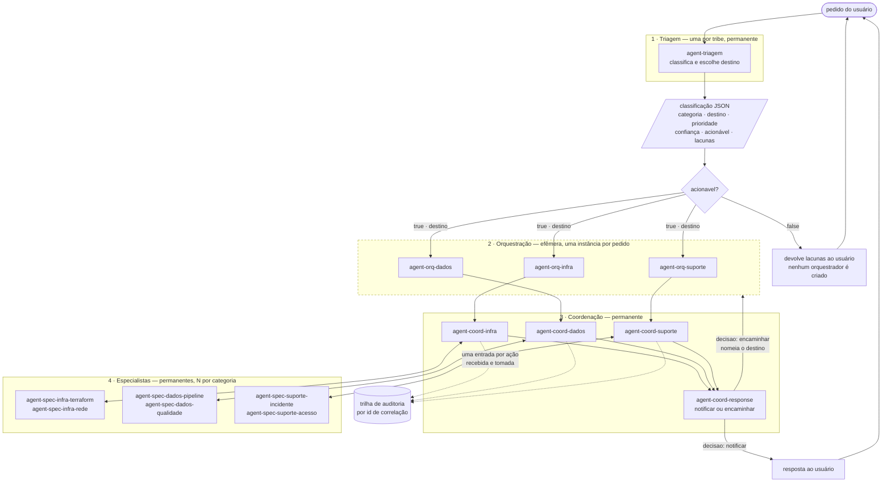
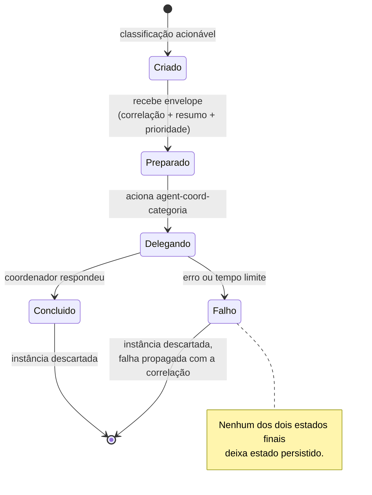
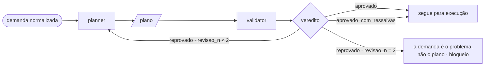
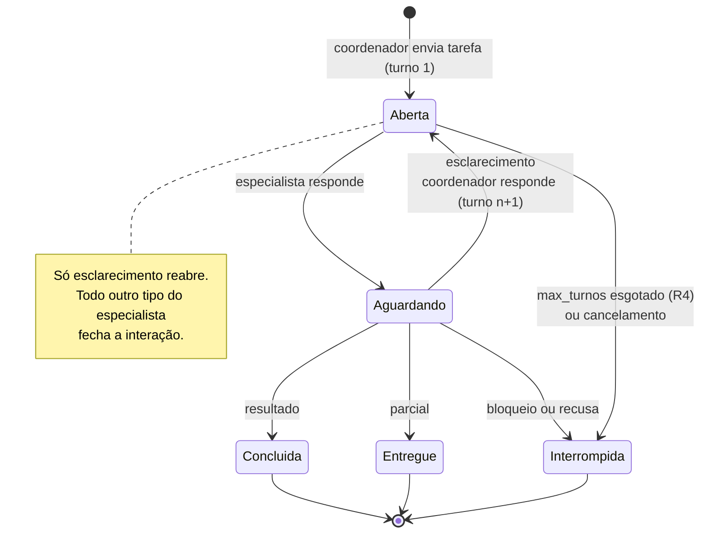
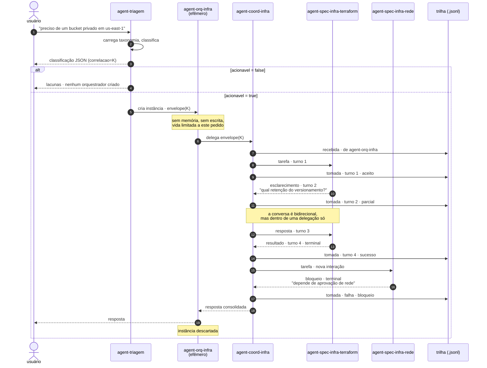

# SDD · Tribe com orquestradores efêmeros

**Documento de Desenho de Software**
**Versão:** 0.1 (rascunho para revisão)
**Status:** proposto — não implementado
**Escopo:** a arquitetura de quatro camadas da tribe, sobre o harness OAF deste repositório

---

## 1. Objetivo

Especificar uma tribe em que um pedido do usuário atravessa quatro camadas com
responsabilidades separadas:

1. **Triagem** classifica o pedido e escolhe o destino.
2. Um **orquestrador efêmero**, criado por pedido, conduz aquele pedido e morre.
3. Um **coordenador de squad**, permanente, atende a categoria e **registra em
   log tudo o que recebe e tudo o que aciona**.
4. **Agentes especializados** executam o trabalho concreto.

O que este documento decide: as taxonomias de nome, os contratos de dados entre
camadas, o ciclo de vida do orquestrador efêmero, o modelo de log, e os casos de
uso que a tribe deve atender.

O que **não** decide: a implementação. Ver [§10](#10-delta-em-relação-ao-que-existe-hoje)
para o que muda no que já está no repositório.

---

## 2. Visão geral da tribe



O tracejado da camada 2 marca o que é efêmero. As camadas 1, 3 e 4 são
permanentes: existem como diretórios no disco e atendem muitos pedidos.

As setas entre coordenação e especialistas são **bidirecionais**: o especialista
não devolve só o resultado, ele conversa — pede esclarecimento, entrega parcial,
declara bloqueio.

A seta de `agent-coord-response` de volta à camada 2 é o **encaminhamento**, e é
a única que sobe. Repare que ela vai para o orquestrador, não direto para outro
coordenador: o coordenador de resposta *nomeia* o destino, quem executa é quem
conduz o pedido. A razão está na [§4.5](#45-coordenador-de-resposta--agent-coord-response).

---

## 3. Taxonomia de nomes

### 3.1 O conflito com a spec, e a proposta

A taxonomia pedida usa **underscore**: `agent_orq_<categoria>`,
`agent_coord_<categoria>`. A spec do OAF exige `vendorKey` e `agentKey` em
**kebab-case**, e define `slug` como `vendorKey/agentKey`. Verificado contra o
validador deste repositório:

| Identificador | `is_kebab_case` | Consequência |
|---|---|---|
| `agent_orq_infra` | ✗ | `oaf validate --profile strict` **reprova** com `identity.not-kebab-case` |
| `agent-orq-infra` | ✓ | passa |

Três saídas possíveis:

| Opção | Consequência |
|---|---|
| **A — hífen em tudo** (recomendada) | `agent-orq-infra` é o nome único, em disco, no JSON e no log. Uma representação só, sem tradução. |
| B — underscore no domínio, hífen no disco | `agent_orq_infra` no JSON e no log, `agent-orq-infra` no `agentKey`, com bijeção `_ ↔ -`. Preserva o vocabulário pedido, ao custo de duas representações do mesmo nome. |
| C — underscore em tudo | Exige rodar sempre em perfil `lenient` e rebaixar `identity.not-kebab-case`, abrindo mão da checagem de identidade para *todos* os agentes. |

**Recomendação: A.** Duas representações do mesmo identificador é a origem
clássica de bug de roteamento — basta uma tradução esquecida em um ponto para o
pedido cair no vazio. O ganho da B é vocabulário; o custo é uma classe de
defeito. A C troca uma regra de qualidade global por uma preferência de grafia.

O restante deste documento usa a opção A. Se a decisão for a B, o único ponto
que muda é a fronteira de serialização — os contratos da [§5](#5-contratos-de-dados)
passam a carregar a forma com underscore, e o carregador aplica a bijeção.

### 3.2 As quatro formas

| Camada | Padrão | Exemplos | Cardinalidade |
|---|---|---|---|
| Triagem | `agent-triagem` | `agent-triagem` | 1 por tribe |
| Orquestração | `agent-orq-<categoria>` | `agent-orq-infra` | 1 **instância por pedido** |
| Coordenação | `agent-coord-<categoria>` | `agent-coord-dados` | 1 por categoria |
| Especialista | `agent-spec-<categoria>-<especialidade>` | `agent-spec-infra-terraform` | N por categoria, **mínimo 2** |

Dois desses especialistas são **obrigatórios em todo squad**, e a
[§4.6](#46-a-composição-mínima-de-um-squad-planner-e-validator) diz por quê:

| Papel | Nome | Faz |
|---|---|---|
| Planner | `agent-spec-<categoria>-planner` | transforma a demanda em plano verificável |
| Validator | `agent-spec-<categoria>-validator` | julga o plano, sem corrigi-lo |

`<categoria>` vem do enum fechado da triagem. Acrescentar uma categoria implica
acrescentar, no mínimo, um orquestrador e um coordenador — ver
[UC-10](#uc-10--nova-categoria-entra-na-tribe).

### 3.3 Regra de derivação

O campo `destino` da classificação **é** o `agentKey` do orquestrador:

```
destino = "agent-orq-" + categoria
```

Essa derivação é a única ligação entre triagem e orquestração. Não há tabela de
roteamento em lugar nenhum: acrescentar uma categoria e criar o diretório
`agent-orq-<categoria>/` basta.

> **Invariante R1.** Para toda `categoria` acionável do enum, existe um agente
> com `agentKey == "agent-orq-" + categoria`. Verificável estaticamente, sem
> executar modelo.

---

## 4. Componentes

### 4.1 Triagem — `agent-triagem`

**Responsabilidade.** Classificar o pedido e escolher o destino. Nada mais.

**Entrada.** Texto livre do usuário.
**Saída.** A classificação JSON da [§5.1](#51-classificação-de-triagem).

Quando `acionavel` é `false`, **nenhum orquestrador é criado**: a triagem
devolve as lacunas e o fluxo termina. Isso é o que torna a camada efêmera
barata — pedidos incompletos não custam instância.

### 4.2 Orquestrador efêmero — `agent-orq-<categoria>`

**Responsabilidade.** Conduzir *um* pedido, da classificação até a resposta.

Efêmero tem significado preciso aqui, e cada item é verificável:

| Propriedade | Significado | Como se verifica |
|---|---|---|
| Sem estado | não declara bloco `memory:` | estático, no manifesto |
| Sem escrita | não tem tool que altere o mundo; `config.tools.denied` cobre shell e rede | estático |
| Instância por pedido | recebe um `correlacao` e não o reusa | em runtime, no log |
| Vida limitada | termina após a delegação retornar; teto de profundidade e de tempo | em runtime |
| Sem memória entre pedidos | dois pedidos idênticos produzem dois traços independentes | em runtime, no log |

A **definição** é permanente — é um diretório em disco. A **instância** é que é
efêmera. Essa distinção importa: versionar o comportamento do orquestrador é
versionar o diretório, como qualquer outro agente OAF.

**Por que existir**, se a triagem já escolheu o destino: a orquestração é onde
mora a política *daquela categoria* — se um pedido de infra precisa passar por
aprovação de custo antes do coordenador, se um incidente crítico aciona
escalonamento em paralelo. Colocar isso na triagem a faria crescer sem limite;
colocar no coordenador misturaria política de entrada com execução.



### 4.3 Coordenador de squad — `agent-coord-<categoria>`

**Responsabilidade.** Atender a categoria acionando especialistas, e **registrar
o que recebe e o que aciona**.

É a única camada que escreve log de negócio, e a razão é topológica: é o único
ponto por onde passa tanto a entrada quanto todas as saídas de uma categoria.

**Obrigações:**

1. Emitir uma entrada de log `direcao: "recebida"` ao receber a delegação.
2. Emitir uma entrada `direcao: "tomada"` por especialista acionado, com o
   resultado.
3. Propagar o `correlacao` **inalterado** para cada especialista.
4. Nunca executar o trabalho por conta própria. Se nenhum especialista cobre o
   pedido, registrar `resultado: "recusado"` e devolver o motivo.

### 4.4 Especialista — `agent-spec-<categoria>-<especialidade>`

**Responsabilidade.** O trabalho concreto — e **conversar com o coordenador
enquanto o faz**.

#### Stateless

O especialista não guarda nada entre invocações. Sua saída é função do envelope
que recebeu e de mais nada.

> **Invariante R6.** Especialista não declara `memory:` e não persiste estado.
> Duas invocações com o mesmo envelope são independentes: nenhuma influencia a
> outra.

O estado que a conversa da [§5.4](#54-envelope-de-turno) precisa — o que já foi
perguntado, o que já foi respondido — mora no **coordenador**, que reenvia o
contexto necessário a cada turno. Isso é o que permite que o especialista seja
substituído, replicado ou reiniciado no meio de uma interação sem perder nada.

Repare na assimetria proposital das três camadas de baixo:

| Camada | Estado | Onde vive |
|---|---|---|
| Orquestrador | efêmero, por pedido | nenhum — descartado ao fim (§4.2) |
| Coordenador | permanente | a trilha de log, e o contexto da interação em curso |
| Especialista | nenhum | — |

O coordenador é o único que acumula. É por isso que ele é também o único que
escreve log: quem tem o estado é quem pode contar a história.

O especialista não é uma função que recebe entrada e devolve saída. Ele pode
responder pedindo esclarecimento, entregando resultado parcial, ou declarando
que está bloqueado. O coordenador responde, e a troca continua até um desfecho.

#### Duas direções que não são a mesma coisa

Bidirecional aqui significa **falar de volta com quem delegou**, não delegar
adiante. A distinção é estrutural, não semântica:

| Movimento | Permitido | Por quê |
|---|---|---|
| Especialista → coordenador (resposta, pergunta, bloqueio) | **sim** | é a conversa desta seção; mantém o grafo com uma única aresta |
| Especialista → outro especialista | **não** | reabre o grafo e tira o coordenador do caminho, deixando a trilha incompleta |
| Especialista → orquestrador ou triagem | **não** | pula camadas; quem reclassifica é o coordenador (UC-11) |

> **Invariante R2 (revisada).** Especialista não declara `agents:` no manifesto.
> A conversa com o coordenador acontece **dentro de uma delegação**, como turnos,
> não como uma segunda delegação em sentido contrário.

#### Por que não é uma referência mútua

A tentação é declarar `agents:` nos dois lados — o coordenador apontando para o
especialista e o especialista apontando de volta. **Isso não funciona**, e a
falha é imediata: o resolvedor do harness percorre o grafo de delegação e
rejeita o par com `agent.cycle`. Verificado:

```
$ oaf validate ./par-mutuo
t/coord v1.0.0 — FAILED
  error[agent.cycle] delegation cycle: t/coord -> t/spec -> t/coord
```

E a rejeição está certa. Uma referência mútua diz "estes dois se delegam
mutuamente", que é um grafo sem fim. O que se quer dizer é outra coisa: "esta
delegação tem mais de um turno". São afirmações diferentes, e só a segunda tem
desfecho garantido.

Consequência de desenho: a bidirecionalidade **não aparece no manifesto**. Ela é
um contrato de mensagens ([§5.4](#54-envelope-de-turno)) mais um limite de
turnos, ambos fora do que a spec do OAF sabe declarar.

### 4.5 Coordenador de resposta — `agent-coord-response`

**Responsabilidade.** Decidir o que acontece quando um coordenador de categoria
termina: **a resposta volta ao usuário, ou outra categoria precisa agir?**

É chamado pelo coordenador de categoria, nunca pelo orquestrador nem pela
triagem. Recebe o desfecho — concluído, parcial ou bloqueado — e emite uma
decisão ([§5.6](#56-decisão-de-resposta)).

#### Nomeia o destino; não o chama

Quando a decisão é `encaminhar`, o coordenador de resposta **nomeia** a categoria
alvo. Quem executa o encaminhamento é quem conduz o pedido — o orquestrador
efêmero da camada 2.

A razão é a mesma da [§4.4](#44-especialista--agent-spec-categoria-especialidade):
se ele declarasse os coordenadores em `agents:` enquanto eles o declaram, o par
vira referência mútua e o resolvedor reprova com `agent.cycle`. Verificado no
repositório — `tests/test_tribe.py::test_a_mutual_reference_would_be_rejected`
constrói o par e confirma a rejeição, para que a razão fique registrada como
teste e não como comentário.

O encaminhamento é **dado que sobe**, não uma chamada que desce.

#### Limite de encaminhamentos

> **Invariante R7.** `handoff_n` nunca passa de 2. No segundo encaminhamento já
> realizado, a decisão é obrigatoriamente `notificar`.

Um pedido pode legitimamente atravessar duas categorias — provisionar e depois
liberar acesso. Três é quase sempre sinal de que a triagem errou a categoria de
origem, e o custo de continuar é um pedido circulando entre times sem ninguém
dar retorno. No limite, a notificação diz o que ficou de fora e qual seria a
próxima categoria; o usuário decide se abre pedido novo — o que também dá à
triagem a chance de classificar melhor.

> **Invariante R8.** Nunca encaminhar de volta para a categoria que acabou de
> trabalhar. Ela devolveu porque terminou o que podia; devolver é laço.

### 4.6 A composição mínima de um squad: planner e validator

Todo squad tem, no mínimo, dois especialistas — e eles não são dois quaisquer.

| Papel | Recebe | Emite | Nunca faz |
|---|---|---|---|
| **Planner** | a demanda normalizada | um plano de passos verificáveis ([§5.7](#57-plano)) | executar, ou aprovar o próprio plano |
| **Validator** | o plano | um veredito com achados ([§5.8](#58-veredito)) | corrigir o plano, ou propor alternativa |

#### Por que dois agentes, e não um

Um agente que planeja e se aprova **racionaliza as próprias premissas**. Ele
escolheu a região porque lhe pareceu razoável; ao revisar, continua parecendo
razoável, pelo mesmo motivo que a fez parecer razoável na primeira vez. A
separação não é cerimônia de processo: é a única forma de a premissa ser lida
por quem não a formulou.

É a mesma razão pela qual o validador **não corrige**. Um validador que
reescreve o passo passa a ter autoria, e na rodada seguinte está julgando o
próprio trabalho — a separação se dissolve em duas trocas.

#### O laço de revisão



> **Invariante R9.** `revisao_n` nunca passa de 2. Na terceira reprovação o
> problema deixou de ser o plano: é a demanda. O validador emite `reprovado` com
> um bloqueador dizendo isso, e o coordenador trata como bloqueio — o que leva a
> [UC-22](#uc-22--encaminhamento-para-outra-categoria) ou a uma notificação.

Ressalva não reprova. `aprovado_com_ressalvas` segue para execução carregando os
achados leves junto, porque parar um plano executável por questão de
nomenclatura custa uma rodada e não compra nada.

#### O que muda por categoria

O contrato é o mesmo nas três; o que muda é o **critério**, e ele mora na skill
do validador:

| Categoria | O planner ordena por | O validador reprova por |
|---|---|---|
| `infraestrutura` | dependência entre recursos | baseline de segurança, raio de alcance, reversibilidade |
| `dados` | definição antes de investigação | definição não estabelecida, backfill marcado como reversível, impacto a jusante omitido |
| `suporte` | contenção → confirmação → causa | causa antes de contenção, confirmação sem limiar e janela, paliativo sem volta |

---

## 5. Contratos de dados

### 5.1 Classificação de triagem

Já existe em `tribe/manager/skills/taxonomia/resources/triagem.schema.json`. As
mudanças que este desenho exige:

| Campo | Hoje | Passa a ser |
|---|---|---|
| `destino` | enum `tribe/infra` \| `tribe/dados` \| `tribe/suporte` \| `nenhum` | `agent-orq-<categoria>` derivado, ou `nenhum` |
| `correlacao` | — | **novo**: identificador do pedido, gerado na triagem, propagado até a folha |

### 5.2 Envelope de delegação

O que atravessa cada fronteira entre camadas. Igual em todas, o que permite que
a trilha seja reconstruída sem conhecer a camada:

```json
{
  "correlacao": "01JQ8F3K2M4N5P6Q7R8S9T0V1W",
  "origem": "agent-orq-infra",
  "destino": "agent-coord-infra",
  "categoria": "infraestrutura",
  "prioridade": "alta",
  "resumo": "Provisionar bucket S3 privado em us-east-1, ambiente dev",
  "contexto": {}
}
```

`resumo` é o texto **normalizado** pela triagem, nunca o pedido original — a
mesma regra que o squad em `squad/` já segue.

### 5.3 Entrada de log do coordenador

Uma linha JSON por ação. Formato de linhas JSON (`.jsonl`), append-only.

```json
{
  "ts": "2026-08-27T14:03:12.481Z",
  "correlacao": "01JQ8F3K2M4N5P6Q7R8S9T0V1W",
  "coordenador": "agent-coord-infra",
  "direcao": "recebida",
  "contraparte": "agent-orq-infra",
  "acao": "atender-provisionamento",
  "resultado": "aceito",
  "detalhe": "Pedido aceito; dois especialistas serão acionados",
  "duracao_ms": 0
}
```

| Campo | Tipo | Valores |
|---|---|---|
| `ts` | string | ISO 8601 em UTC, com milissegundos |
| `correlacao` | string | idêntico em toda a trilha de um pedido |
| `coordenador` | string | `agent-coord-<categoria>` |
| `direcao` | string | `recebida` \| `tomada` |
| `contraparte` | string | quem delegou, ou quem foi acionado |
| `acao` | string | verbo em kebab-case |
| `resultado` | string | `aceito` \| `sucesso` \| `parcial` \| `falha` \| `recusado` |
| `detalhe` | string | uma frase; sem segredo, sem dado pessoal |
| `duracao_ms` | número | `0` para `recebida` |
| `interacao` | string | presente quando a entrada pertence a uma conversa com especialista |
| `turno` | número | o turno registrado; ausente na entrada `recebida` do orquestrador |

Com a conversa da [§5.4](#54-envelope-de-turno), **uma entrada de log por
turno** — não uma por especialista. Um especialista que pediu esclarecimento e
depois entregou produz três entradas: a tarefa, a pergunta respondida, o
resultado. É isso que torna a trilha reconstruível: sem o turno, uma conversa de
três idas aparece como uma ação só, e a auditoria perde justamente onde a
decisão foi tomada.

> **Invariante R3 (revisada).** Toda entrada `recebida` de uma correlação tem
> zero ou mais entradas `tomada` com a mesma correlação, e o conjunto fecha:
> nenhuma `tomada` existe sem a `recebida` correspondente. Dentro de uma
> `interacao`, os turnos são consecutivos e o último é terminal (R5).

### 5.4 Envelope de turno

O que atravessa a fronteira entre coordenador e especialista, nos dois sentidos.
Um envelope por turno.

```json
{
  "correlacao": "01JQ8F3K2M4N5P6Q7R8S9T0V1W",
  "interacao": "01JQ8F3K2M4N5P6Q7R8S9T0V1W-02",
  "turno": 2,
  "de": "agent-spec-infra-terraform",
  "para": "agent-coord-infra",
  "tipo": "esclarecimento",
  "conteudo": "Qual retenção aplicar ao versionamento do bucket?",
  "pendencias": ["retencao_dias"],
  "terminal": false
}
```

| Campo | Tipo | Descrição |
|---|---|---|
| `correlacao` | string | o pedido, igual da triagem à folha |
| `interacao` | string | **uma** conversa entre um coordenador e um especialista |
| `turno` | número | 1, 2, 3… dentro da interação |
| `de` / `para` | string | os dois lados, sempre coordenador e especialista |
| `tipo` | string | ver as tabelas abaixo |
| `conteudo` | string | a mensagem |
| `pendencias` | lista | o que falta, quando `tipo` é `esclarecimento` ou `parcial` |
| `terminal` | booleano | `true` fecha a interação |

#### Do coordenador para o especialista

| `tipo` | Significa | `terminal` |
|---|---|---|
| `tarefa` | o trabalho inicial | `false` |
| `resposta` | responde a um `esclarecimento` | `false` |
| `cancelamento` | abandone; o pedido mudou ou expirou | `true` |

#### Do especialista para o coordenador

| `tipo` | Significa | `terminal` |
|---|---|---|
| `resultado` | terminei, aqui está | `true` |
| `esclarecimento` | preciso disto para prosseguir | `false` |
| `parcial` | fiz até aqui; falta isto e não depende de mim | `true` |
| `bloqueio` | não consigo prosseguir; precisa de outro especialista ou de humano | `true` |
| `recusa` | não é do meu escopo; sugiro quem atende | `true` |

Só `esclarecimento` mantém a conversa aberta vindo do especialista. `parcial` e
`bloqueio` **fecham** a interação: entregam o que há e devolvem a decisão ao
coordenador, que pode abrir uma **nova** interação com outro especialista. Isso
é deliberado — uma conversa que pode virar qualquer coisa é uma conversa sem
desfecho garantido.

#### Limite de turnos

> **Invariante R4.** Toda interação termina. `max_turnos` é 6 por padrão; ao
> esgotar sem envelope `terminal`, o coordenador encerra por conta própria,
> registra `resultado: "falha"` com `detalhe: "limite-de-turnos"`, e trata como
> `bloqueio`.

Seis turnos são três idas e voltas. Um especialista que precisa de mais que isso
está com a tarefa mal definida, e o lugar de corrigir é a interação anterior —
não uma sétima pergunta.

> **Invariante R5.** Uma interação tem turnos consecutivos a partir de 1, com
> exatamente um envelope `terminal`, e ele é o último.

#### A interação, como máquina de estados



Um `bloqueio` não é o fim do pedido, só desta interação: o coordenador pode
abrir outra, com outro especialista e turno reiniciado — ver
[UC-17](#uc-17--especialista-declara-bloqueio-e-o-coordenador-reencaminha).

### 5.5 Quem escreve o log — a decisão que mais importa aqui

Há duas fontes possíveis, e elas **não** têm o mesmo valor:

| Fonte | O que é | Confiabilidade |
|---|---|---|
| **Log declarado pelo agente** | o coordenador emite as entradas como parte da sua resposta, como a triagem emite o JSON | é uma *afirmação* do modelo. Pode omitir uma ação que tomou, ou declarar uma que não tomou |
| **Traço do harness** | o harness registra `build`, `delegate` e `complete` ao executá-los | é um *registro*. Só existe se a coisa aconteceu |

**Proposta.** Implementar as duas, com papéis distintos: o traço do harness é a
fonte de verdade para auditoria; o log declarado carrega a semântica de negócio
(o `acao`, o `detalhe`) que o harness não conhece. A conciliação entre os dois —
toda delegação do traço tem uma entrada `tomada` correspondente — vira uma
verificação, e a divergência é sinal de que o coordenador não está registrando o
que faz.

Nenhum dos dois existe hoje no harness. O traço é a mudança de núcleo que este
desenho exige; ver [§10](#10-delta-em-relação-ao-que-existe-hoje).

### 5.6 Decisão de resposta

O que o coordenador de resposta emite. **Implementado** em `tribe/response/`.

```json
{
  "correlacao": "01JQ8F3K2M4N5P6Q7R8S9T0V1W",
  "decisao": "encaminhar",
  "destino": "tribe/dados",
  "handoff_n": 0,
  "motivo": "Recurso provisionado; configurar a escrita da pipeline é trabalho de dados",
  "mensagem_usuario": null,
  "contexto_handoff": {
    "recurso": "s3://dev-checkout-artifacts",
    "ja_feito": "Bucket criado, privado, versionado",
    "pendente": "Apontar a pipeline de build para o novo bucket"
  }
}
```

| Campo | Tipo | Descrição |
|---|---|---|
| `correlacao` | string | o pedido, inalterado |
| `decisao` | string | `notificar` ou `encaminhar` |
| `destino` | string ou null | o coordenador alvo quando `encaminhar` |
| `handoff_n` | número | encaminhamentos já ocorridos nesta correlação (R7) |
| `motivo` | string | por que esta decisão e não a outra |
| `mensagem_usuario` | string ou null | o texto final quando `notificar` |
| `contexto_handoff` | objeto ou null | o que a próxima categoria precisa saber |

**Invariantes.** `notificar` → `destino` e `contexto_handoff` nulos, e
`mensagem_usuario` não vazia. `encaminhar` → destino real, contexto não vazio,
`mensagem_usuario` nula, e `handoff_n` abaixo do limite (R7).

Um `contexto_handoff` vazio faria a próxima categoria recomeçar do zero — é a
falha silenciosa desta camada, porque o pedido *parece* ter seguido.

#### A mensagem ao usuário não nomeia agente

O usuário não sabe que a tribe existe. `mensagem_usuario` não contém
`agent-`, `tribe/`, "coordenador", "especialista" nem "squad" — verificado em
`tests/test_tribe.py::test_the_user_message_names_no_agent`.

E um parcial é apresentado como parcial. Maquiar um parcial de sucesso é a única
forma de errar nesta camada que o usuário não consegue detectar.

### 5.7 Plano

O que o planner emite. **Implementado** em `tribe/<categoria>-planner`.

```json
{
  "correlacao": "01JQ8F3K2M4N5P6Q7R8S9T0V1W",
  "categoria": "infraestrutura",
  "passos": [
    {
      "n": 1,
      "acao": "Criar bucket S3 privado em us-east-1",
      "altera": "cria recurso novo",
      "requer": ["nome_projeto", "ambiente"],
      "verificacao": "get-public-access-block retorna true nos quatro campos"
    }
  ],
  "premissas": ["O provedor é AWS, conforme a demanda"],
  "riscos": ["Nome de bucket é global; colisão exige sufixo"],
  "reversivel": true,
  "aprovacao_humana": []
}
```

| Campo | Descrição |
|---|---|
| `passos[].altera` | `cria recurso novo`, `altera existente`, `destroi`, `somente leitura` |
| `passos[].requer` | valores que o passo precisa e ainda não tem |
| `passos[].verificacao` | **como saber que deu certo**, observável |
| `premissas` | o que o planner assumiu que a demanda não disse |
| `reversivel` | `false` se algum passo destrói dado |
| `aprovacao_humana` | passos que ninguém executa sem alguém aprovar |

**Todo passo tem `verificacao`.** Passo sem forma de conferir não é plano, é
intenção — e é a primeira coisa que o validador procura. Se o planner não sabe
verificar, o passo está grande demais.

**Premissa é declarada, não escondida.** Uma região escolhida porque a demanda
não disse é premissa. Escondê-la é o que faz um plano ruim parecer bom.

### 5.8 Veredito

O que o validator emite. **Implementado** em `tribe/<categoria>-validator`.

```json
{
  "correlacao": "01JQ8F3K2M4N5P6Q7R8S9T0V1W",
  "veredito": "reprovado",
  "revisao_n": 0,
  "achados": [
    {
      "passo": 2,
      "severidade": "critica",
      "problema": "Security group permite 0.0.0.0/0 na porta 5432",
      "correcao": "Restringir à sub-rede da aplicação, ou usar endpoint privado"
    }
  ],
  "bloqueadores": []
}
```

| Campo | Valores |
|---|---|
| `veredito` | `aprovado`, `aprovado_com_ressalvas`, `reprovado` |
| `revisao_n` | revisões já ocorridas (R9) |
| `achados[].passo` | o número do passo, ou `0` para o plano inteiro |
| `achados[].severidade` | `critica`, `alta`, `media`, `baixa` |
| `bloqueadores` | o que impede julgar: informação ausente no próprio plano |

**Invariantes.** `aprovado` → `achados` vazio. `aprovado_com_ressalvas` → há
achados e nenhum é `critica` ou `alta`. `reprovado` → ao menos um `critica` ou
`alta`. `revisao_n` no máximo 2 (R9).

`bloqueadores` não é sinônimo de achado. Achado é problema **no** plano;
bloqueador é o plano não estar completo o bastante para ser julgado — sem
`verificacao` em passo algum, por exemplo. Nesse caso `achados` fica vazio de
propósito.

**Um plano sem achados é resultado possível.** Validador que sempre acha algo
ensina o planner a ignorar validação, e a partir daí o par existe só no
organograma.

---

## 6. Fluxo completo



---

## 7. Casos de uso

| ID | Caso | Ator | Camadas envolvidas |
|---|---|---|---|
| [UC-01](#uc-01--pedido-acionável-roteado-e-atendido) | Pedido acionável roteado e atendido | usuário | 1 → 4 |
| [UC-02](#uc-02--pedido-incompleto-devolvido) | Pedido incompleto devolvido | usuário | 1 |
| UC-03 | Pedido fora de escopo recusado | usuário | 1 |
| [UC-04](#uc-04--categoria-sem-orquestrador-provisionado) | Categoria sem orquestrador provisionado | operador | 1 → 2 |
| UC-05 | Coordenador aciona um único especialista | — | 3 → 4 |
| UC-06 | Coordenador aciona vários especialistas | — | 3 → 4 |
| UC-07 | Nenhum especialista cobre o pedido | — | 3 |
| UC-08 | Especialista falha e o coordenador registra | — | 3 → 4 |
| [UC-09](#uc-09--auditoria-de-um-pedido-por-correlação) | Auditoria de um pedido por correlação | auditor | log |
| [UC-10](#uc-10--nova-categoria-entra-na-tribe) | Nova categoria entra na tribe | operador | 1 → 3 |
| UC-11 | Coordenador discorda da triagem e devolve | — | 3 → 1 |
| UC-12 | Incidente crítico com escalonamento paralelo | usuário | 2 → 4 |
| UC-13 | Orquestrador excede o tempo limite | — | 2 |
| UC-14 | Divergência entre traço e log declarado | auditor | log |
| [UC-15](#uc-15--especialista-pede-esclarecimento) | Especialista pede esclarecimento | — | 3 ↔ 4 |
| UC-16 | Especialista entrega resultado parcial | — | 3 ↔ 4 |
| [UC-17](#uc-17--especialista-declara-bloqueio-e-o-coordenador-reencaminha) | Especialista declara bloqueio e o coordenador reencaminha | — | 3 ↔ 4 |
| UC-18 | Especialista recusa por escopo e sugere quem atende | — | 3 ↔ 4 |
| [UC-19](#uc-19--limite-de-turnos-esgotado) | Limite de turnos esgotado | — | 3 ↔ 4 |
| UC-20 | Coordenador cancela uma interação em curso | — | 3 ↔ 4 |
| [UC-21](#uc-21--resposta-volta-ao-usuário) | Resposta volta ao usuário | usuário | 3 → 1 |
| [UC-22](#uc-22--encaminhamento-para-outra-categoria) | Encaminhamento para outra categoria | — | 3 → 2 → 3 |
| [UC-23](#uc-23--limite-de-encaminhamentos-atingido) | Limite de encaminhamentos atingido | usuário | 3 |
| UC-24 | Bloqueio que depende de humano vira notificação, não encaminhamento | usuário | 3 |
| [UC-25](#uc-25--plano-aprovado-de-primeira) | Plano aprovado de primeira | — | 4 |
| [UC-26](#uc-26--plano-reprovado-e-revisado) | Plano reprovado e revisado | — | 4 |
| UC-27 | Plano aprovado com ressalvas segue com os achados | — | 4 |
| [UC-28](#uc-28--terceira-reprovação-a-demanda-é-o-problema) | Terceira reprovação: a demanda é o problema | — | 4 → 3 |
| UC-29 | Validador bloqueia por plano incompleto | — | 4 |

### UC-01 · Pedido acionável roteado e atendido

**Ator:** usuário. **Pré-condição:** existe `agent-orq-<categoria>` para a
categoria classificada (R1).

1. O usuário descreve o pedido em linguagem natural.
2. A triagem carrega a taxonomia, classifica, gera `correlacao` e emite o JSON
   com `acionavel: true` e `destino` derivado da categoria.
3. Uma instância de `agent-orq-<categoria>` é criada com o envelope.
4. O orquestrador aplica a política da categoria e delega ao coordenador.
5. O coordenador registra `recebida`, aciona os especialistas necessários e
   registra uma `tomada` por especialista.
6. O coordenador consolida e devolve; o orquestrador devolve ao usuário e é
   descartado.

**Pós-condição:** a trilha da correlação está fechada (R3) e nenhum estado do
orquestrador persistiu.

### UC-02 · Pedido incompleto devolvido

**Ator:** usuário.

1. A triagem classifica com `acionavel: false` e ao menos uma lacuna.
2. **Nenhum orquestrador é criado** e nenhuma entrada de log é escrita — não
   houve ação de coordenador.
3. As lacunas voltam ao usuário como perguntas.

**Fluxo alternativo:** o usuário responde e o pedido reentra pelo UC-01, com uma
**nova** correlação. Um pedido incompleto e sua reformulação são dois pedidos.

### UC-04 · Categoria sem orquestrador provisionado

**Ator:** operador da tribe. **Gatilho:** a invariante R1 foi violada — o enum de
categorias ganhou um valor sem o diretório correspondente.

1. A triagem classifica em uma categoria acionável.
2. A derivação produz um `destino` que não resolve para agente algum.
3. O sistema **falha explicitamente**, nomeando o `agentKey` esperado.

Não há degradação para uma categoria vizinha: rotear para o squad errado é pior
que não rotear, porque consome o tempo do time errado e esconde a lacuna de
provisionamento.

**Prevenção:** R1 é verificável estaticamente, então isto deve reprovar em CI
antes de chegar a runtime.

### UC-09 · Auditoria de um pedido por correlação

**Ator:** auditor. **Pré-condição:** a trilha contém a correlação.

1. O auditor filtra a trilha por `correlacao`.
2. Obtém a entrada `recebida`, com quem delegou e quando.
3. Obtém as entradas `tomada`, em ordem, com contraparte, resultado e duração.
4. Reconstrói o que foi feito, por quem e com que desfecho — sem ler prosa.

**Pós-condição:** a reconstrução é completa se R2 e R3 valerem. R2 garante que
não há delegação abaixo do especialista escapando ao registro.

### UC-15 · Especialista pede esclarecimento

**Ator:** nenhum humano. **Pré-condição:** interação aberta, turno abaixo de
`max_turnos`.

1. O coordenador envia `tipo: "tarefa"` no turno 1 e registra a entrada.
2. O especialista identifica um campo que falta e responde
   `tipo: "esclarecimento"`, com `pendencias` nomeando o campo, `terminal: false`.
3. O coordenador registra o turno e decide:
   - tem a informação → responde `tipo: "resposta"` e a conversa segue;
   - não tem → fecha a interação e devolve a pendência ao orquestrador, que a
     devolve ao usuário. **Não inventa o valor.**
4. Com a resposta, o especialista conclui com `tipo: "resultado"`, `terminal: true`.

**Pós-condição:** a interação tem turnos consecutivos, o último terminal (R5), e
uma entrada de log por turno.

**Por que o coordenador não responde por conta própria:** o campo que falta
costuma ser uma decisão do usuário — região, retenção, ambiente. Um coordenador
que preenche o vazio transforma uma pergunta em um palpite, três camadas longe
de quem sabe a resposta.

### UC-17 · Especialista declara bloqueio e o coordenador reencaminha

**Ator:** nenhum humano.

1. O especialista responde `tipo: "bloqueio"`, `terminal: true`, dizendo o que o
   impede — dependência de outro domínio, permissão ausente, decisão humana.
2. O coordenador registra `resultado: "falha"` com o detalhe do bloqueio.
3. O coordenador abre uma **nova interação** com o especialista adequado, se
   houver, com nova `interacao` e turno reiniciado em 1.
4. Se não houver especialista para o bloqueio, o coordenador devolve ao
   orquestrador com o motivo.

**Pós-condição:** duas interações distintas na mesma correlação. A trilha mostra
a tentativa que falhou e a que a substituiu — perder a primeira esconderia por
que a segunda foi necessária.

### UC-19 · Limite de turnos esgotado

**Ator:** nenhum humano. **Gatilho:** R4.

1. A conversa chega a `max_turnos` sem envelope `terminal`.
2. O coordenador encerra por conta própria, registra `resultado: "falha"` com
   `detalhe: "limite-de-turnos"`, e trata como bloqueio.
3. A resposta ao usuário diz que a tarefa não convergiu e mostra as `pendencias`
   do último turno.

**Pós-condição:** nenhuma interação fica aberta. R5 vale mesmo aqui: o
encerramento do coordenador **é** o envelope terminal.

**Leitura do sinal:** esgotar turnos com frequência em uma categoria não é
problema de limite, é tarefa mal definida chegando ao especialista. O lugar de
corrigir é a interação anterior.

### UC-25 · Plano aprovado de primeira

**Ator:** nenhum humano.

1. O coordenador envia a demanda normalizada ao planner.
2. O planner emite o plano, com `verificacao` em todo passo e as premissas
   declaradas.
3. O coordenador envia o plano ao validator.
4. O validator emite `aprovado`, com `achados` vazio.
5. O coordenador segue para execução e registra os turnos.

**Pós-condição:** `revisao_n` permanece 0.

### UC-26 · Plano reprovado e revisado

**Ator:** nenhum humano. **Pré-condição:** `revisao_n` abaixo de 2 (R9).

1. O validator emite `reprovado` com ao menos um achado `critica` ou `alta`.
2. O coordenador devolve **os achados** ao planner — não o veredito inteiro, e
   nunca uma reescrita própria.
3. O planner emite um plano novo. `revisao_n` incrementa.
4. O validator julga o plano novo, sem memória do anterior (R6): ele julga o que
   recebeu.

**Pós-condição:** duas interações na mesma correlação, ambas na trilha. Perder a
primeira esconderia por que a segunda existiu.

**Detalhe deliberado:** achados `media` e `baixa` viajam junto com os graves. O
planner corrige tudo de uma vez, em vez de descobrir a ressalva na rodada
seguinte.

### UC-28 · Terceira reprovação: a demanda é o problema

**Ator:** nenhum humano. **Gatilho:** R9 — `revisao_n` chegou a 2 e o veredito
seria `reprovado` de novo.

1. O validator emite `reprovado` com um bloqueador dizendo que o limite de
   revisões foi atingido.
2. O coordenador **não pede um quarto plano**. Trata como bloqueio.
3. O coordenador chama `agent-coord-response`, que decide entre encaminhar e
   notificar ([UC-22](#uc-22--encaminhamento-para-outra-categoria),
   [UC-21](#uc-21--resposta-volta-ao-usuário)).

**Leitura do sinal:** três planos reprovados não é planner ruim. É demanda que
não determina o suficiente para haver plano executável — e o lugar de corrigir
isso é a triagem, não a quarta tentativa.

### UC-21 · Resposta volta ao usuário

**Ator:** usuário. **Pré-condição:** um coordenador de categoria terminou.

1. O coordenador chama `agent-coord-response` com o desfecho.
2. O coordenador de resposta decide `notificar`: o pedido original está atendido,
   ou o que falta depende do usuário.
3. Emite a decisão com `destino` e `contexto_handoff` nulos e a
   `mensagem_usuario` escrita para quem não conhece a tribe.
4. A mensagem chega ao usuário.

**Pós-condição:** nenhum encaminhamento; `handoff_n` inalterado.

**Regra que sustenta o caso:** um resultado parcial é apresentado **como
parcial**. Maquiar parcial de sucesso é a única forma de errar nesta camada que
o usuário não consegue detectar.

### UC-22 · Encaminhamento para outra categoria

**Ator:** nenhum humano. **Pré-condição:** `handoff_n` abaixo de 2 (R7).

1. O coordenador de resposta decide `encaminhar`, nomeia o `destino` e monta o
   `contexto_handoff` com o que já foi feito e o que falta.
2. **Ele não chama o destino.** A decisão sobe para o orquestrador efêmero, que
   conduz o pedido.
3. O orquestrador incrementa `handoff_n` e delega ao coordenador nomeado, com a
   mesma `correlacao`.
4. O ciclo recomeça na camada 3, e a trilha continua na mesma correlação.

**Pós-condição:** uma correlação, dois coordenadores, `handoff_n` incrementado.

**Fluxo alternativo:** o destino nomeado é a categoria que acabou de trabalhar →
violação de R8. O encaminhamento é recusado e vira notificação.

### UC-23 · Limite de encaminhamentos atingido

**Ator:** usuário. **Gatilho:** R7 — `handoff_n` já é 2.

1. O coordenador de resposta identifica que outra categoria poderia contribuir.
2. **Decide `notificar` mesmo assim**, com o `motivo` dizendo que o limite foi
   atingido.
3. A `mensagem_usuario` diz o que foi feito, o que ficou de fora, e que abrir um
   pedido novo o leva direto ao time certo.

**Pós-condição:** o pedido termina. Nenhuma correlação fica aberta circulando.

**Leitura do sinal:** atingir o limite com frequência não é problema do limite —
é a triagem errando a categoria de origem. O lugar de corrigir é a taxonomia.

### UC-10 · Nova categoria entra na tribe

**Ator:** operador. Exemplo: acrescentar `seguranca`.

1. Acrescenta `seguranca` ao enum `categoria` do schema de triagem.
2. Acrescenta a linha correspondente na tabela de fronteiras da skill
   `taxonomia` — sem ela a triagem não sabe distinguir a categoria nova das
   vizinhas.
3. Cria `agent-orq-seguranca/` e `agent-coord-seguranca/`.
4. Cria ao menos um `agent-spec-seguranca-*`.
5. CI verifica R1 e reprova se algum passo ficou para trás.

**Pós-condição:** nenhuma tabela de roteamento foi editada — a derivação da
[§3.3](#33-regra-de-derivação) cobre a categoria nova automaticamente.

---

## 8. Requisitos não funcionais

| # | Requisito | Verificação |
|---|---|---|
| NF-1 | Toda camada permanente passa em `oaf validate --profile strict` | CI |
| NF-2 | O orquestrador não declara `memory:` nem tool de escrita | estático, no manifesto |
| NF-3 | O `correlacao` é idêntico da triagem à folha | teste de trilha |
| NF-4 | O log não contém credencial nem dado pessoal | revisão do contrato + teste de padrões |
| NF-5 | A trilha é append-only; nenhuma entrada é reescrita | modo de abertura do arquivo |
| NF-6 | Especialista não declara `agents:` (R2) | estático, no manifesto |
| NF-9 | Toda interação termina em no máximo `max_turnos` (R4) | teste de limite |
| NF-10 | Turnos de uma interação são consecutivos, com um único terminal ao fim (R5) | teste de trilha |
| NF-11 | Nenhuma referência mútua entre coordenador e especialista | `oaf validate` — o ciclo já reprova |
| NF-12 | Especialista não declara `memory:` nem persiste estado (R6) | estático, no manifesto |
| NF-13 | `handoff_n` nunca passa de 2 (R7) | teste de contrato |
| NF-14 | Nunca encaminhar de volta à categoria que acabou de trabalhar (R8) | teste de contrato |
| NF-15 | `mensagem_usuario` não nomeia agente, camada ou squad | teste sobre os exemplos |
| NF-16 | `agent-coord-response` não declara `agents:` | estático — é o que mantém o grafo acíclico |
| NF-17 | Todo squad tem exatamente um planner e um validator, ambos `required` | estático, em CI |
| NF-18 | Planner e validator são agentes distintos | estático — quem planeja não aprova |
| NF-19 | `revisao_n` nunca passa de 2 (R9) | teste de contrato |
| NF-20 | Validador tem `temperature: 0.0` | estático — veredito que varia não é veredito |
| NF-7 | Toda categoria acionável tem orquestrador e coordenador (R1) | estático, em CI |
| NF-8 | Uma falha de especialista não perde a trilha da correlação | teste de falha |

---

## 9. Riscos

| Risco | Impacto | Mitigação |
|---|---|---|
| Log declarado pelo modelo é afirmação, não registro | auditoria falsa passa por verdadeira | conciliar com o traço do harness (§5.5); divergência é alarme, não ruído |
| Quatro camadas custam quatro chamadas de modelo | latência e custo por pedido multiplicados | orquestrador e coordenador podem usar modelo menor; medir antes de otimizar |
| Duas representações do mesmo nome (opção B) | pedido roteado ao vazio | escolher a opção A |
| A camada de orquestração pode ficar vazia de propósito | uma indireção que só repassa | se a política da categoria couber em uma frase, a camada não se justifica ainda — decidir por categoria, não por simetria |
| Enum de categoria e diretórios divergem | UC-04 em produção | R1 em CI |
| Conversa coordenador ↔ especialista não converge | custo e latência sem desfecho | R4: teto de turnos, e só `esclarecimento` mantém a conversa aberta |
| Tentar declarar a bidirecionalidade como `agents:` mútuo | o harness reprova com `agent.cycle` | está documentado na §4.4; a conversa é protocolo, não topologia |
| Coordenador responde um esclarecimento inventando o valor | palpite vira decisão, três camadas longe de quem sabe | UC-15 passo 3: sem a informação, devolve a pendência |
| Encaminhamento sem `contexto_handoff` | a próxima categoria recomeça do zero, e o pedido *parece* ter seguido | invariante da §5.6, verificada nos exemplos |
| Parcial apresentado como sucesso | o usuário não tem como detectar | regra explícita na skill e no manifesto do responder |
| Ping-pong entre categorias | pedido circula sem retorno a quem pediu | R7 (teto de 2) e R8 (não volta para quem acabou) |
| Planner e validator colapsarem em um agente só | a premissa passa a ser lida por quem a formulou | NF-18; a separação é o mecanismo, não o processo |
| Validador que sempre acha algo | o planner aprende a ignorá-lo | regra explícita: plano sem achados é resultado possível |
| Validador que corrige em vez de julgar | passa a ter autoria e julga o próprio trabalho na rodada seguinte | regra explícita nos três validadores |

---

## 10. Delta em relação ao que existe hoje

| Componente | Hoje no repositório | Este desenho |
|---|---|---|
| Triagem | `tribe/manager`, classifica e delega direto ao squad | mantém; `destino` passa a ser derivado e ganha `correlacao` |
| Orquestração | **não existe** — a triagem delega direto | camada nova, efêmera, uma por categoria |
| Coordenação | `tribe/infra`, `tribe/dados`, `tribe/suporte` são terminais | viram coordenadores: delegam a especialistas e registram log |
| Especialistas | **não existem** — `squad/terraform` é o mais próximo | camada nova; `squad/` pode ser absorvido como especialista de infra |
| Log | **não existe** | contrato da §5.3, mais o traço de harness da §5.5 |
| Correlação | **não existe** | atravessa todas as camadas |
| Conversa multi-turno | **não existe** — hoje uma delegação é uma ida e volta | envelope de turno da §5.4, com teto e registro por turno |
| Coordenador de resposta | **implementado** em `tribe/response`, chamado pelos três coordenadores | mantém; sob a taxonomia da §3.1 passa a `agent-coord-response` |
| Planner e validator | **implementados** — um par por squad, seis agentes | mantêm; sob a taxonomia passam a `agent-spec-<categoria>-<papel>` |

O `tribe/response` é a primeira parte deste desenho que existe em código. Ele
foi implementável hoje porque não depende do traço nem do multi-turno: é um
agente que emite uma decisão, e a decisão é dado.

**Mudança de núcleo exigida.** O traço do harness (§5.5) não é configuração: é
funcionalidade nova em `src/oaf/runtime/`. Hoje o `BuildResult` carrega as
decisões de construção, mas nada registra a execução. Essa é a única alteração
no harness que este desenho pede — o resto é definição de agente e contrato de
dados.

---

## 11. Questões em aberto

1. **A opção da §3.1** — A, B ou C. Todo o resto do documento depende dela.
2. **Onde a trilha é escrita.** Arquivo por tribe, por categoria, ou por dia?
   Append-only local resolve o começo; um coletor externo muda o contrato.
3. **Quem gera o `correlacao`.** A triagem é o lugar natural, mas nada no harness
   gera identificador hoje — e `Math.random`/relógio dentro de agente prejudica
   reprodutibilidade de teste. Provavelmente pertence ao chamador.
4. **Se a camada de orquestração se justifica em todas as categorias.** Ver o
   risco correspondente na §9.
5. **Política de retentativa.** Quem repete um especialista que falhou: o
   coordenador, ou o orquestrador? Afeta R3 — uma retentativa é uma `tomada`
   nova ou a mesma? Com a §5.4, a resposta provável é: uma **nova interação**,
   como em UC-17.
6. **`max_turnos` é global ou por categoria?** Seis é um chute informado. Uma
   categoria com especialistas que dependem de dado externo pode precisar de
   mais; medir antes de fixar.
7. **Como o turno é executado no harness.** Uma conversa multi-turno entre líder
   e membro exige que o líder reinvoque o membro mantendo o contexto da
   interação. É possível no adapter atual, mas não é o caminho que ele exercita
   hoje — e é a segunda coisa a validar num piloto, depois do traço.
