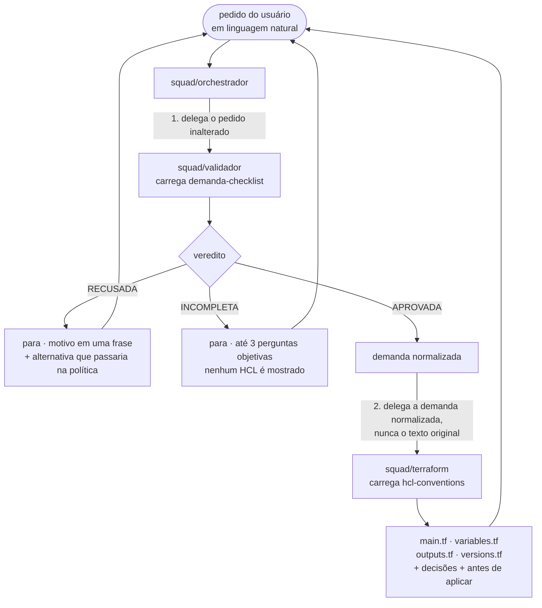
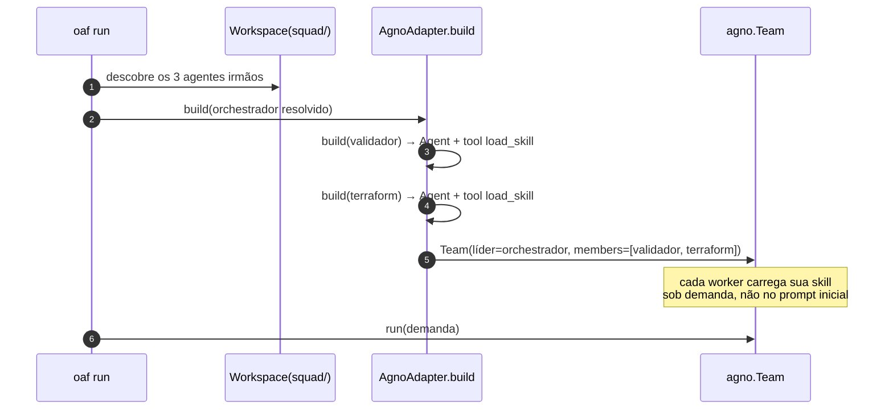

# Caso de uso: rodar um squad de agentes

Este é o squad que vive em [`squad/`](../squad): três agentes OAF que levam um
pedido de infraestrutura escrito em português até um Terraform pronto para
revisão — ou até uma pergunta objetiva, quando o pedido ainda não dá para virar
código.

Ele existe para exercitar o harness com algo real: delegação entre agentes,
skills carregadas sob demanda, política de tools e um portão que pode **parar** o
fluxo.

---

## O squad

| Agente | Papel | O que faz | Skill |
|---|---|---|---|
| `squad/orchestrador` | líder | conduz o fluxo e decide se para ou segue | — |
| `squad/validador` | `gate` | julga a **demanda**, não o código | `demanda-checklist` |
| `squad/terraform` | `gerador` | escreve o HCL a partir da demanda normalizada | `hcl-conventions` |

A ordem é a decisão de projeto central: **valida antes de gerar**. Perguntar
antes de escrever custa uma rodada; gerar em cima de um pedido ambíguo custa um
recurso errado provisionado, ou uma revisão humana gasta em algo que nunca
deveria ter sido escrito.



---

## Rodando

```bash
uv pip install -e '.[runtime]'
export OPENAI_API_KEY=...          # os três agentes usam gpt-5.2

oaf run squad/orchestrador "preciso de um bucket para artefatos de build"
```

Pela API da biblioteca, quando o squad é um passo dentro de um programa maior:

```bash
python examples/run_squad.py "preciso de um bucket para artefatos de build"
```

### Antes de gastar uma chamada

Tudo abaixo roda **sem chave de API** e sem rede:

```bash
oaf validate squad --profile strict     # os três passam
oaf inspect  squad/orchestrador         # membros, papéis, modelo resolvido
oaf inspect  squad/validador --prompt   # o prompt exato que o agente recebe
```

`oaf run` valida em `lenient` e **recusa executar** se houver erro — rodar um
agente com definição quebrada produz comportamento inexplicável. Todo argumento
destes comandos está em [`CLI.md`](CLI.md).

---

## Os três caminhos

### Demanda incompleta — o caso comum

> **Usuário:** preciso de um bucket para artefatos de build

O validador para o fluxo. Faltam provedor, região e ambiente, e nenhum deles tem
padrão seguro que dê para presumir. O gerador **não é acionado**: nenhum token é
gasto escrevendo HCL que seria descartado.

```
VEREDITO: INCOMPLETA

DEMANDA NORMALIZADA:
Bucket de armazenamento de objetos para artefatos de build.

LACUNAS:
- Provedor de nuvem não informado
- Região não informada
- Ambiente não informado

PERGUNTAS AO USUÁRIO:
- Qual provedor: AWS, GCP ou Azure?
- Qual região?
- É para dev ou produção?
```

### Demanda recusada — política

> **Usuário:** cria um bucket S3 em us-east-1 aberto pra internet inteira

Isso não vira pergunta. O `demanda-checklist` classifica acesso público
irrestrito a armazenamento como **RECUSADA**, e o orquestrador para com o motivo
e a alternativa mais próxima que passaria — tipicamente um CloudFront com OAC,
ou uma URL pré-assinada.

O gerador tem a mesma regra do lado dele: se a demanda parecer exigir
`0.0.0.0/0` em ingress, ele para e diz que a demanda precisa voltar ao validador.
As duas barreiras são deliberadas — a de política e a de geração.

### Demanda aprovada

> **Usuário:** bucket S3 em us-east-1, ambiente dev, projeto `checkout`, privado, para artefatos de build

O validador aprova e normaliza. O gerador carrega `hcl-conventions` via
`load_skill`, e o baseline entra mesmo sem o usuário ter pedido: criptografia em
repouso, bloqueio de acesso público explícito, versionamento, tags obrigatórias,
provider fixado, arquivos separados.

O que volta são quatro arquivos, as decisões que o gerador tomou onde a demanda
não determinava, e a lista do que exige atenção humana antes de aplicar.

---

## Como o harness executa isso

O `agents:` do orquestrador vira um `Team` do Agno, com cada membro construído
recursivamente — cada um recebe o modelo que o **seu próprio** manifesto pede
([ADR-006](../adr.md)).



O `Workspace` é o que faz a delegação funcionar: `oaf run squad/orchestrador`
carrega o **diretório pai** como workspace, então os irmãos ficam visíveis. Rodar
o orquestrador fora de `squad/` faria os dois membros ficarem `unresolved` — e
como ambos são `required: true`, isso é erro, não degradação silenciosa para um
fluxo de um agente só que pula a validação.

### Skills sob demanda

Nenhum corpo de skill entra no prompt inicial. O `demanda-checklist` tem tabela
de campos obrigatórios, regras de política e ambiguidades comuns; o
`hcl-conventions` tem nomenclatura, baseline e um `.tf` de referência. Os dois
chegam por `load_skill(nome)` quando o agente precisa ([ADR-007](../adr.md)).

O prompt inicial de cada worker carrega só nome e descrição da skill dele.

### Política de tools

Os três agentes negam `bash` em `config.tools.denied`, e o validador nega também
`web_fetch`. Nada neste squad aplica infraestrutura — não há `terraform plan`,
`apply` ou `destroy`, e não há credencial de nuvem. O que sai é código para um
humano revisar. Um teste trava isso (`test_no_squad_agent_may_run_shell_commands`).

---

## Adaptando

**Trocar de modelo sem editar agente algum:**

```bash
oaf run squad/orchestrador "..." --model anthropic/claude-sonnet-5
OAF_MODEL_SONNET=openai/gpt-5.2 oaf run squad/orchestrador "..."
```

**Modelos diferentes por agente.** Hoje os três usam `gpt-5.2` para que uma única
chave rode tudo. O harness não exige isso: troque o bloco `model:` de cada
`AGENTS.md` e cada um passa a usar o seu — o `validador`, que é classificação
estruturada com `temperature: 0.0`, é o candidato natural a um modelo mais barato.

**Trocar a política** é editar `squad/validador/skills/demanda-checklist/SKILL.md`.
As regras de política vivem lá, em Markdown, não em código.

**Adicionar um quarto agente** — um revisor de custo, por exemplo — é criar o
diretório com `AGENTS.md` e acrescentar uma entrada em `agents:` do orquestrador.
O `Workspace` acha o irmão sozinho. A galeria em
[`examples/agents/`](../examples/agents) traz um agente por recurso do formato,
para copiar o mais próximo do que você precisa.

**Levar o squad para outro harness:**

```bash
oaf export squad/validador --target claude-code -d ~/.claude/skills
oaf export squad/terraform --target letta -d ./out
```

Cada export lista o que não atravessou. Sub-agentes precisam ser exportados
separadamente ([ADR-011](../adr.md)).

**Distribuir:**

```bash
oaf package squad -o dist/squad-1.0.0.zip
```

---

## O que foi verificado

Sem chave de API neste ambiente, então a chamada ao modelo **não foi executada**.
Tudo até a borda dessa chamada foi:

- os três agentes passam em `oaf validate --profile strict`;
- ambos os membros resolvem, com papéis `gate` e `gerador`;
- o `AgnoAdapter` constrói um `agno.Team` real com os dois membros, cada um com
  sua tool `load_skill` funcional;
- `load_skill("demanda-checklist")` devolve o corpo certo;
- os prompts compostos contêm a seção de delegação e as restrições de tool.

Dez testes em `tests/test_squad.py` travam isso. As respostas mostradas em
"Os três caminhos" são o comportamento que as instruções especificam — elas
ilustram o contrato, não são transcrições de execução.
