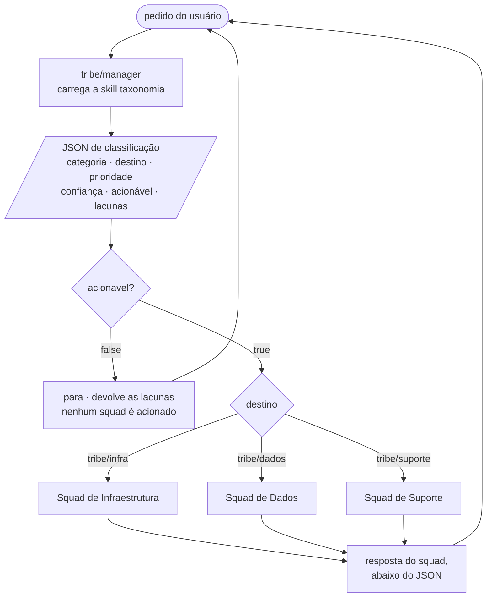

# Tribe · triagem e roteamento

Uma tribe é um gerente de triagem e os squads que ele aciona. O gerente
**categoriza e classifica o pedido do usuário em JSON**, e em seguida encaminha
ao squad responsável.

| Agente | Papel | Atende |
|---|---|---|
| `tribe/manager` | triagem | classifica em JSON e roteia |
| `tribe/infra` | `squad-infraestrutura` | provisionamento, rede, acesso de máquina, custo |
| `tribe/dados` | `squad-dados` | pipelines, qualidade, modelagem, relatórios |
| `tribe/suporte` | `squad-suporte` | incidentes, dúvidas, acesso de pessoa, bugs |



## Rodando

```bash
export OPENAI_API_KEY=...
oaf run tribe/manager "o checkout está fora do ar desde as 14h"
```

Pela API da biblioteca, que já extrai o JSON para o chamador agir sobre ele:

```bash
python examples/run_tribe.py "o checkout está fora do ar desde as 14h"
```

Sem gastar chamada:

```bash
oaf validate tribe --profile strict
oaf inspect  tribe/manager            # os três squads e seus papéis
oaf inspect  tribe/manager --prompt   # o contrato JSON, como o agente o recebe
```

## O contrato JSON

O gerente emite a classificação **primeiro**, sozinha, em um bloco ` ```json `,
e só depois a resposta do squad, separada por `---`.

```json
{
  "categoria": "suporte",
  "subcategoria": "incidente",
  "destino": "tribe/suporte",
  "prioridade": "critica",
  "confianca": 1.0,
  "acionavel": true,
  "lacunas": [],
  "resumo": "Checkout indisponível desde 14h, impedindo finalização de pedidos",
  "justificativa": "Produção parada com impacto em receita; é incidente, não trabalho planejado"
}
```

O contrato completo está em
[`manager/skills/taxonomia/resources/triagem.schema.json`](manager/skills/taxonomia/resources/triagem.schema.json),
publicado para quem consome a saída.

### Invariantes

| Regra | Consequência |
|---|---|
| `acionavel: false` | `destino` é `"nenhum"` e `lacunas` não está vazio |
| `acionavel: true` | `lacunas` é `[]` e há um destino real |
| `confianca` < `0.6` | não é acionável — baixa confiança é lacuna, não palpite |
| `categoria: "fora_de_escopo"` | `destino` é `"nenhum"` e não é acionável |

> **O que garante isso.** As invariantes vivem nas instruções e nos exemplos
> resolvidos, não em código: o harness não valida a saída de um agente, e a spec
> do OAF não tem campo para declarar schema de saída. Os testes verificam que os
> exemplos que ensinam o contrato o obedecem, e que o prompt menciona todo campo
> e todo valor de enum — mas o cumprimento em execução depende do modelo.
> `examples/run_tribe.py` mostra a extração do lado do chamador, incluindo o
> caso em que o JSON não veio.

## Como a triagem decide

A skill `taxonomia` traz as fronteiras que confundem. A regra que resolve a
maioria dos empates:

> **Está quebrado agora → `suporte`. É trabalho novo → `infraestrutura` ou `dados`.**

| Pedido | Vai para |
|---|---|
| "o banco está lento" | `suporte` |
| "quero um banco novo" | `infraestrutura` |
| "o relatório está com número errado" | `dados` |
| "o relatório não abre" | `suporte` |
| "preciso de acesso ao cluster" | `infraestrutura` |
| "preciso de acesso ao dashboard" | `suporte` |

Prioridade vem do **impacto declarado**, não da urgência com que foi escrito.
"URGENTE!!!" sem impacto descrito não é `critica`.

## Para onde isto vai

[`docs/SDD.md`](../docs/SDD.md) especifica uma evolução desta tribe em quatro
camadas: a triagem passa a rotear para **orquestradores efêmeros**
(`agent-orq-<categoria>`, uma instância por pedido), que delegam a
**coordenadores** (`agent-coord-<categoria>`) que registram em log tudo o que
recebem e tudo o que acionam, e que por sua vez chamam **especialistas**
(`agent-spec-<categoria>-<especialidade>`).

É proposta, não implementação. Os três squads deste diretório são hoje terminais.

## Adaptando

**Novo squad na tribe** — crie o diretório com `AGENTS.md`, acrescente uma
entrada em `agents:` do gerente, e some a categoria em três lugares: o enum de
`categoria` e o de `destino` no schema, e a tabela de fronteiras da skill. Os
testes reprovam se um deles ficar para trás.

**Mudar a taxonomia** é editar `manager/skills/taxonomia/SKILL.md`. As regras
moram em Markdown, não em código.

**Ligar a tribe ao squad de Terraform** em [`squad/`](../squad): o `tribe/infra`
é hoje terminal. Para fazê-lo delegar, acrescente `squad/orchestrador` ao
`agents:` dele e monte um workspace com os dois diretórios:

```python
ws = Workspace.from_path(Path("tribe"))
for agente in Workspace.from_path(Path("squad")).agents:
    ws.add(agente)
```

Pelo CLI isso exige que os dois estejam sob a mesma raiz, porque
`oaf run tribe/infra` só enxerga os irmãos de `tribe/`.
